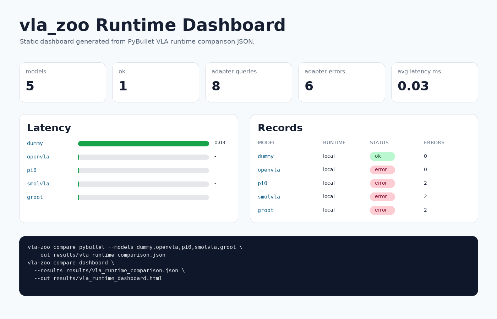
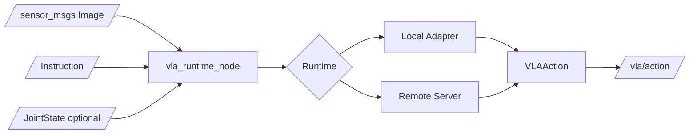

# vla_zoo

ROS2-native runtime, benchmark, and adapter hub for Vision-Language-Action models.

[](https://github.com/rsasaki0109/vla_zoo/actions/workflows/ci.yml)
[](pyproject.toml)
[](LICENSE)
[](docs/ros2_integration.md)
[](https://rsasaki0109.github.io/vla_zoo/)

> VLA models are moving fast. Robots still need stable runtime interfaces.  
> vla_zoo connects camera + instruction + robot state to actions through ROS2-native adapters.

Live demo page: https://rsasaki0109.github.io/vla_zoo/



## 30 Second Demo

```bash
pip install -e ".[dev,cli,server,sim]"
vla-zoo predict --model dummy --instruction "hello"
vla-zoo compare adapters
vla-zoo demo pybullet --model dummy --out docs/assets/simulation_pick_place.gif
```

No GPU, model download, or ROS2 install is required for the dummy path.

## Demos

This GIF is rendered from a PyBullet simulation: Franka Panda URDF, cube, gravity, inverse kinematics, gripper command, and a fixed grasp constraint. It is still a demo scene, not a real robot performance claim.


The PyBullet controller keeps the scene deterministic, while the selected VLA adapter is queried on rendered observations and its action output is overlaid. That makes the same smoke scene usable for `dummy`, local OpenVLA, or remote pi0/SmolVLA/GR00T-style servers.

Regenerate it locally with:

```bash
pip install -e ".[sim]"
vla-zoo demo pybullet --model dummy --out docs/assets/simulation_pick_place.gif
```

Use the same demo loop with any adapter that implements `predict()`:

```bash
# local OpenVLA, if the optional ML dependencies and weights are available
vla-zoo demo pybullet --model openvla --instruction "pick up the red block"

# remote VLA server on a GPU workstation
vla-zoo demo pybullet \
  --model openvla \
  --runtime remote \
  --remote-url http://gpu-box:8000

# future remote adapters
vla-zoo demo pybullet --model pi0 --runtime remote --remote-url http://gpu-box:8000
vla-zoo demo pybullet --model smolvla --runtime remote --remote-url http://gpu-box:8000
vla-zoo demo pybullet --model groot --runtime remote --remote-url http://gpu-box:8000
```

## Compare VLA Runtime Paths

Compare adapter availability without loading heavy model weights:

```bash
vla-zoo compare adapters
```

Run the same deterministic PyBullet smoke scene across adapters:

```bash
vla-zoo compare pybullet --models dummy,openvla,pi0,smolvla,groot
```

By default, the local PyBullet comparison skips heavy local OpenVLA loading so it does not accidentally download weights. Use a remote GPU server for real cross-model runtime checks:

```bash
vla-zoo compare pybullet \
  --models openvla,pi0,smolvla,groot \
  --runtime remote \
  --remote-url http://gpu-box:8000
```

If each model is served by a separate process, pass a model-to-endpoint map and write README-ready results:

```bash
vla-zoo compare pybullet \
  --models openvla,pi0,smolvla,groot \
  --runtime remote \
  --remote-map "openvla=http://gpu-box:8001,pi0=http://gpu-box:8002,smolvla=http://gpu-box:8003,groot=http://gpu-box:8004" \
  --out results/vla_runtime_comparison.json \
  --markdown-out results/vla_runtime_comparison.md \
  --html-out results/vla_runtime_comparison.html
```

The same setup can be checked into a JSON manifest:

```bash
vla-zoo compare pybullet --manifest examples/compare/pybullet_vla_remote.json
```

For a no-GPU remote smoke test, run a dummy server and use the smoke manifest:

```bash
vla-zoo serve --model dummy --host 127.0.0.1 --port 8010
vla-zoo compare pybullet --manifest examples/compare/pybullet_dummy_remote.json
```

The manifest path writes JSON, Markdown, and a self-contained HTML report under `results/`.

Build an interactive dashboard from one or more comparison result files:

```bash
vla-zoo compare dashboard \
  --results results/vla_runtime_comparison.json \
  --out results/vla_runtime_dashboard.html
```

Build the same dashboard from ROS2 runtime logs:

```bash
ros2 launch vla_zoo log_recorder.launch.py output_dir:=results
vla-zoo compare dashboard \
  --status-log results/vla_status.jsonl \
  --diagnostics-log results/vla_diagnostics.jsonl \
  --out results/vla_ros_runtime_dashboard.html
vla-zoo report bundle \
  --status-log results/vla_status.jsonl \
  --diagnostics-log results/vla_diagnostics.jsonl \
  --out results/vla_runtime_report_bundle.zip
```

## What works today

- `load_model("dummy")` runs without a GPU or model download.
- `vla-zoo predict --model dummy --instruction "hello"` returns a typed `VLAAction`.
- `vla-zoo serve --model dummy --port 8000` exposes `/health`, `/v1/models`, and `/v1/predict`.
- `ros2 launch vla_zoo dummy.launch.py` starts a dry-run ROS2 runtime node with status and diagnostics.
- Third-party adapters can be added through Python entry points.

## What to Run Next

```bash
pip install -e ".[dev,cli,server,sim]"
vla-zoo predict --model dummy --instruction "hello"
vla-zoo demo pybullet --model dummy --out docs/assets/simulation_pick_place.gif
vla-zoo compare adapters
```

For remote-runtime smoke testing:

```bash
vla-zoo serve --model dummy --host 127.0.0.1 --port 8010
vla-zoo compare pybullet --manifest examples/compare/pybullet_dummy_remote.json
```

For ROS2 dry-run testing:

```bash
pip install -e .
colcon build --base-paths ros2 --symlink-install
source install/setup.bash
ros2 launch vla_zoo dummy.launch.py
```

If ROS2 is using a different Python interpreter than your editable install, make the core package visible before launching:

```bash
export PYTHONPATH="$PWD/src:$PYTHONPATH"
```

Dry-run suppresses action publications by default. For demo logging, opt in:

```bash
ros2 launch vla_zoo dummy.launch.py publish_actions_in_dry_run:=true
```

## Why vla_zoo?

VLA models are arriving quickly, but real robots need stable runtime interfaces:

```text
camera + instruction + state -> action
```

`vla_zoo` is not a training framework and it does not redistribute model weights. It is a runtime boundary for local or remote VLA inference, ROS2 topic integration, action-space metadata, and benchmark orchestration.

## Quickstart

```bash
pip install vla_zoo
```

```python
from vla_zoo import load_model

model = load_model("dummy")
action = model.predict(image=None, instruction="hello")
print(action)
```

For local development:

```bash
pip install -e ".[dev,cli,server]"
pytest
vla-zoo list
vla-zoo predict --model dummy --instruction "hello"
```

## OpenVLA

OpenVLA is an external project. Install its heavy dependencies only when needed:

```bash
pip install "vla_zoo[openvla]"
```

```python
from PIL import Image
from vla_zoo import load_model

image = Image.open("examples/assets/example.png").convert("RGB")
model = load_model(
    "openvla",
    pretrained="openvla/openvla-7b",
    device="cuda:0",
    dtype="bfloat16",
    unnorm_key="bridge_orig",
)
action = model.predict(image=image, instruction="pick up the red block")
print(action)
```

## ROS2

```bash
pip install -e .
colcon build --base-paths ros2 --symlink-install
source install/setup.bash
ros2 launch vla_zoo dummy.launch.py
```

The launchable runtime can publish actions, status, and diagnostics. In dry-run mode it suppresses action messages unless `publish_actions_in_dry_run:=true` is set, and it never directly commands hardware.

```bash
ros2 launch vla_zoo openvla.launch.py dry_run:=true
ros2 launch vla_zoo remote.launch.py remote_url:=http://gpu-box:8000
ros2 launch vla_zoo log_recorder.launch.py output_dir:=results
```

## Remote GPU Runtime

Run a server on the GPU machine:

```bash
vla-zoo serve --model dummy --host 0.0.0.0 --port 8000
```

Use the same API from a robot CPU:

```python
from vla_zoo import load_model

model = load_model("dummy", runtime="remote", remote_url="http://gpu-box:8000")
print(model.predict(image=None, instruction="test"))
```

## Architecture



## Supported Adapters

| Adapter | Status | Notes |
|---|---|---|
| `dummy` | available | Always returns neutral 7-DoF actions for tests, docs, and dry runs |
| `openvla` | optional | Hugging Face OpenVLA adapter, installed with `vla_zoo[openvla]` |
| `pi0`, `openpi`, `pi0-fast`, `pi05` | experimental | Remote-first scaffold for openpi/pi0 integration |
| `smolvla`, `lerobot-smolvla` | experimental | Placeholder for LeRobot SmolVLA action-chunk policies |
| `groot`, `gr00t`, `isaac-groot` | experimental | Placeholder for humanoid/generalist GR00T-style stacks |

## Benchmarks

```bash
vla-zoo bench --model dummy --benchmark smoke --episodes 3
```

The benchmark runner uses the same `BaseVLA.predict()` interface as Python, ROS2, and the HTTP server.

## Known Limitations

- vla_zoo does not train VLA models.
- vla_zoo does not guarantee zero-shot success on your robot.
- Real hardware deployment requires robot-specific action bridges and safety checks.
- Model adapters may require large GPU memory and external model licenses.
- The base package intentionally avoids heavy ML dependencies.

## Safety

`vla_zoo` is safe by default: dry-run is enabled in ROS2 configs, dry-run suppresses action publications unless explicitly overridden, and the runtime reports status plus diagnostics. The node includes input freshness watchdogs and optional action clipping, but real robots still need hardware-specific bridges, emergency stop integration, physical limit checks, and a high-rate deterministic controller downstream of the low-rate VLA policy.

## Roadmap

- v0.1: Python API, dummy adapter, OpenVLA scaffold, remote server/client, ROS2 node, smoke benchmark
- v0.2: SmolVLA adapter, openpi remote adapter, GR00T scaffold, ROS bag replay benchmark
- v0.3: LIBERO and SimplerEnv runners, reproducible metrics, latency reports
- v0.4: Lifecycle node, richer diagnostics, watchdog components, bridge examples for MoveIt Servo and ros2_control
- v0.5: external adapter registry, model cards, community benchmarks

## Contributing

Read [CONTRIBUTING.md](CONTRIBUTING.md), [SECURITY.md](SECURITY.md), and [CHANGELOG.md](CHANGELOG.md). The v0.1.0 release checklist lives in [docs/release_v0.1.0.md](docs/release_v0.1.0.md).

Good first adapters include SmolVLA, openpi remote inference, GR00T experiments, LIBERO smoke tasks, SimplerEnv smoke tasks, ROS bag replay loading, MoveIt Servo bridges, ros2_control bridges, Jetson deployment notes, and SO-101 or ALOHA launch examples.

Good first issue areas:

- model adapters: SmolVLA, openpi/pi0 remote inference, GR00T remote inference
- benchmarks: LIBERO, SimplerEnv, ROS bag replay, Genesis, Isaac
- ROS2 runtime: lifecycle node, action bridge examples, richer diagnostics
- deployment docs: Jetson, remote GPU, SO-101, ALOHA
