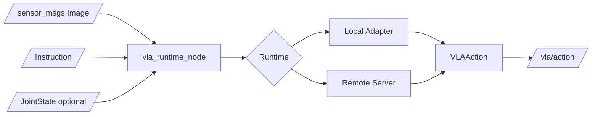

# vla_zoo

ROS2-native runtime, benchmark, and adapter hub for Vision-Language-Action models.

[](https://github.com/rsasaki0109/vla_zoo/actions/workflows/ci.yml)
[](pyproject.toml)
[](LICENSE)
[](docs/ros2_integration.md)
[](https://rsasaki0109.github.io/vla_zoo/)

> VLA models are moving fast. Robots still need stable runtime interfaces.  
> `vla_zoo` connects camera + instruction + robot state to typed actions through
> ROS2-native adapters, remote inference, and reproducible comparison artifacts.

Live demo page: https://rsasaki0109.github.io/vla_zoo/


## What You Get

| Surface | What works now |
|---|---|
| Python API | `load_model("dummy")`, typed `VLAAction`, adapter registry |
| Runtime baselines | `dummy`, `scripted`, and `random` adapters for no-GPU validation |
| VLA adapters | OpenVLA local scaffold; pi0, SmolVLA, and GR00T remote-first placeholders |
| ROS2 runtime | dry-run launch files, action/status topics, diagnostics, log recorder |
| Remote inference | FastAPI server/client with the same `predict()` boundary |
| Simulation demo | real PyBullet Franka pick-and-place scene with adapter action overlay |
| Comparison artifacts | method profiles, PyBullet metrics, HTML report, interactive dashboard |

The base install stays light. Heavy VLA stacks remain optional and external.

## Maturity Matrix

`vla_zoo` is infrastructure, not a claim that every listed VLA is fully supported today.

| Method | Current state | Local inference | Remote inference | What the output means |
|---|---|---:|---:|---|
| `dummy` | implemented baseline | yes | yes | neutral 7-DoF action for CI, docs, and dry-run ROS2 |
| `scripted` | implemented baseline | yes | yes | phase-aware rule baseline for the bundled PyBullet smoke scene |
| `random` | implemented baseline | yes | yes | seeded random action baseline for plumbing and visualization checks |
| `openvla` | adapter scaffold | optional deps required | yes | OpenVLA-style 7-DoF action, model/robot unnormalization dependent |
| `pi0` / `openpi` | remote-first placeholder | no | yes | policy-specific action/chunk interface to be provided by a serving stack |
| `smolvla` | remote-first placeholder | no | yes | multi-camera/state/action-chunk policy interface to be provided by LeRobot |
| `groot` / `gr00t` | experimental placeholder | no | yes | humanoid/generalist action interface, adapter-specific |

The shipped GIFs below are no-GPU runtime baselines. They prove that the observation,
adapter, action, visualization, and reporting path works. They are not VLA model
performance demonstrations.

## 30 Second No-GPU Path

```bash
pip install -e ".[dev,cli,server,sim]"
vla-zoo doctor --no-ros
vla-zoo predict --model dummy --instruction "hello"
vla-zoo compare methods
vla-zoo compare suite --no-pybullet --out-dir results/quick_suite
```

```python
from vla_zoo import load_model

model = load_model("dummy")
action = model.predict(image=None, instruction="pick up the red block")
print(action)
```

No GPU, model download, or ROS2 install is required for this path.

## PyBullet Runtime Smoke Demo

This GIF is rendered from PyBullet: Franka Panda URDF, cube, gravity, inverse
kinematics, gripper command, and a fixed grasp constraint. It is a real simulation
smoke scene for runtime validation, not a policy benchmark or real robot performance claim.


The PyBullet controller keeps the scene deterministic, while the selected adapter is
queried on rendered observations and its action output is overlaid. This deliberately
separates runtime plumbing from model skill. Real VLA evaluation should use the
model's required observation schema, robot-specific action normalization, and a
benchmark or robot setup appropriate for that policy.

Regenerate it:

```bash
pip install -e ".[sim]"
vla-zoo demo pybullet --model dummy --out docs/assets/simulation_pick_place.gif
```

### No-GPU Baseline GIF Gallery

These are all generated from real PyBullet runs. The robot scene is the same, but
the selected baseline adapter is queried through the runtime and its `VLAAction`
output is shown in the overlay. `dummy`, `scripted`, and `random` are not VLA
foundation models.

<table>
  <tr>
    <td width="33%">
      <strong><code>dummy</code></strong><br>
      neutral dry-run action<br>
      
    </td>
    <td width="33%">
      <strong><code>scripted</code></strong><br>
      phase-aware baseline<br>
      
    </td>
    <td width="33%">
      <strong><code>random</code></strong><br>
      seeded random baseline<br>
      
    </td>
  </tr>
</table>

Regenerate the gallery:

```bash
vla-zoo demo pybullet --model dummy --out docs/assets/simulation_dummy.gif
vla-zoo demo pybullet --model scripted --out docs/assets/simulation_scripted.gif
vla-zoo demo pybullet --model random --out docs/assets/simulation_random.gif
```

For heavyweight VLA models, use the same runtime path with local optional dependencies
or a remote GPU server. These commands require real serving environments and should
not be interpreted as pre-generated model-quality results:

```bash
vla-zoo demo pybullet --model openvla --runtime remote --remote-url http://gpu-box:8000
vla-zoo demo pybullet --model pi0 --runtime remote --remote-url http://gpu-box:8000
vla-zoo demo pybullet --model smolvla --runtime remote --remote-url http://gpu-box:8000
vla-zoo demo pybullet --model groot --runtime remote --remote-url http://gpu-box:8000
```

## Comparison Suite

`vla_zoo` can generate a shareable comparison directory for READMEs, issues, and
release notes:

```bash
vla-zoo compare suite --out-dir results/vla_compare_suite
```

It writes:

| Artifact | Purpose |
|---|---|
| `method_profiles.md/json` | VLA method integration profiles without loading weights |
| `pybullet_results.md/json` | deterministic runtime and task telemetry |
| `pybullet_report.html` | self-contained static comparison report |
| `runtime_dashboard.html` | interactive dashboard for latency, errors, and task metrics |
| `README.md` | index page with reproduce command and tables |

[Open the live sample PyBullet report](https://rsasaki0109.github.io/vla_zoo/assets/sample_compare_suite/pybullet_report.html)
or [open the live sample dashboard](https://rsasaki0109.github.io/vla_zoo/assets/sample_compare_suite/runtime_dashboard.html).


The comparison suite is runtime-centric. It tracks availability, errors, latency,
action magnitude, action metadata, and deterministic smoke-scene telemetry. It does
not rank VLA policies by task success.

For a fast metadata-only artifact:

```bash
vla-zoo compare suite --no-pybullet --out-dir results/quick_suite
```

## For VLA Researchers

Most VLA failures at deployment time are not just model failures. They are often
interface failures: camera naming, image preprocessing, proprioception schema,
action unnormalization, gripper convention, chunk timing, controller rate, or stale
observations. `vla_zoo` is designed to make those contracts explicit.

Every adapter should declare:

| Contract | Examples |
|---|---|
| Observation inputs | single RGB image, multi-camera images, instruction, proprioception |
| Action representation | EEF delta, EEF pose, joint position, joint velocity, base twist, gripper, custom |
| Normalization | normalized action, dataset-specific unnormalization key, robot-specific bounds |
| Temporal behavior | single action, action chunk, expected control rate, action `dt` |
| Runtime mode | local model, remote GPU server, ROS2 node, benchmark runner |
| Safety caveats | dry-run behavior, clipping expectations, downstream controller requirements |

The adapter boundary intentionally returns `VLAAction` or `VLAActionChunk`, never a raw
array. That makes action semantics visible to ROS2, dashboards, benchmarks, and future
robot-specific bridges.

`vla_zoo` does not claim:

- zero-shot success on arbitrary robots
- apples-to-apples policy quality comparisons from the bundled PyBullet smoke scene
- direct hardware control
- redistribution of OpenVLA, openpi, SmolVLA, GR00T, or other external weights

## Compare VLA Runtime Paths

Compare adapter availability without loading heavy model weights:

```bash
vla-zoo compare adapters
```

Compare VLA method integration profiles without loading weights:

```bash
vla-zoo compare methods
vla-zoo compare methods --markdown-out results/vla_method_profiles.md
```

This method profile table summarizes input requirements, action shape, action chunks,
proprioception expectations, local/remote runtime support, dependency profile, and license
caveats for baselines, OpenVLA, pi0/openpi, SmolVLA, and GR00T-style adapters.

Run the same deterministic PyBullet smoke scene across the no-GPU baseline adapters:

```bash
vla-zoo compare pybullet --models dummy,scripted,random
```

The comparison records runtime metrics plus scripted-scene telemetry: whether the cube was lifted, final distance to the goal, cube travel distance, grasp-attached frames, and phase completion. The smoke task treats placement inside a 15 cm goal zone as success. This makes reports useful for smoke-testing the full observation-to-action path, but it is still not a claim of model skill because the PyBullet controller keeps the scene deterministic.

The `dummy`, `scripted`, and `random` adapters are no-GPU baselines for validating
the runtime, visualization, and metrics pipeline before comparing heavyweight VLA
policies. Use remote GPU servers for real cross-model runtime checks:

```bash
vla-zoo compare pybullet \
  --models openvla,pi0,smolvla,groot \
  --runtime remote \
  --remote-url http://gpu-box:8000
```

If each model is served by a separate process, pass a model-to-endpoint map and write README-ready results:

```bash
vla-zoo compare pybullet \
  --models openvla,pi0,smolvla,groot \
  --runtime remote \
  --remote-map "openvla=http://gpu-box:8001,pi0=http://gpu-box:8002,smolvla=http://gpu-box:8003,groot=http://gpu-box:8004" \
  --out results/vla_runtime_comparison.json \
  --markdown-out results/vla_runtime_comparison.md \
  --html-out results/vla_runtime_comparison.html
```

The same setup can be checked into a JSON manifest:

```bash
vla-zoo compare pybullet --manifest examples/compare/pybullet_vla_remote.json
```

For a no-GPU remote smoke test, run a dummy server and use the smoke manifest:

```bash
vla-zoo serve --model dummy --host 127.0.0.1 --port 8010
vla-zoo compare pybullet --manifest examples/compare/pybullet_dummy_remote.json
```

The manifest path writes JSON, Markdown, and a self-contained HTML report under `results/`.

Build an interactive dashboard from one or more comparison result files:

```bash
vla-zoo compare dashboard \
  --results results/vla_runtime_comparison.json \
  --out results/vla_runtime_dashboard.html
```

Build the same dashboard from ROS2 runtime logs:

```bash
ros2 launch vla_zoo log_recorder.launch.py output_dir:=results
vla-zoo compare dashboard \
  --status-log results/vla_status.jsonl \
  --diagnostics-log results/vla_diagnostics.jsonl \
  --out results/vla_ros_runtime_dashboard.html
vla-zoo report bundle \
  --status-log results/vla_status.jsonl \
  --diagnostics-log results/vla_diagnostics.jsonl \
  --out results/vla_runtime_report_bundle.zip
```

## Runnable Today

| Goal | Command |
|---|---|
| Check local health | `vla-zoo doctor --no-ros` |
| Predict a typed action | `vla-zoo predict --model dummy --instruction "hello"` |
| Render the PyBullet GIF | `vla-zoo demo pybullet --model dummy --out docs/assets/simulation_pick_place.gif` |
| Compare method profiles | `vla-zoo compare methods` |
| Generate report artifacts | `vla-zoo compare suite --out-dir results/vla_compare_suite` |
| Start a local server | `vla-zoo serve --model dummy --port 8000` |
| Launch ROS2 dry-run | `ros2 launch vla_zoo dummy.launch.py` |

Remote-runtime smoke test:

```bash
vla-zoo serve --model dummy --host 127.0.0.1 --port 8010
vla-zoo compare pybullet --manifest examples/compare/pybullet_dummy_remote.json
```

ROS2 dry-run:

```bash
pip install -e .
colcon build --base-paths ros2 --symlink-install
source install/setup.bash
vla-zoo doctor
ros2 launch vla_zoo dummy.launch.py
```

If ROS2 is using a different Python interpreter than your editable install, make the core package visible before launching:

```bash
export PYTHONPATH="$PWD/src:$PYTHONPATH"
```

Dry-run suppresses action publications by default. For demo logging, opt in:

```bash
ros2 launch vla_zoo dummy.launch.py publish_actions_in_dry_run:=true
```

## Why vla_zoo?

VLA models are arriving quickly, but real robots need stable runtime interfaces:

```text
camera + instruction + state -> action
```

`vla_zoo` is not a training framework and it does not redistribute model weights. It is a runtime boundary for local or remote VLA inference, ROS2 topic integration, action-space metadata, and benchmark orchestration.

In practice, that means:

- research models stay in their own upstream projects
- robot-side ROS2 code sees stable topics and typed actions
- GPU-heavy inference can run remotely
- adapters declare action shape, input needs, and safety caveats
- demos and reports can be regenerated without hand-editing README tables

## Quickstart

```bash
pip install vla_zoo
```

```python
from vla_zoo import load_model

model = load_model("dummy")
action = model.predict(image=None, instruction="hello")
print(action)
```

For local development:

```bash
pip install -e ".[dev,cli,server]"
pytest
vla-zoo list
vla-zoo predict --model dummy --instruction "hello"
```

## OpenVLA

OpenVLA is an external project. Install its heavy dependencies only when needed:

```bash
pip install "vla_zoo[openvla]"
```

```python
from PIL import Image
from vla_zoo import load_model

image = Image.open("examples/assets/example.png").convert("RGB")
model = load_model(
    "openvla",
    pretrained="openvla/openvla-7b",
    device="cuda:0",
    dtype="bfloat16",
    unnorm_key="bridge_orig",
)
action = model.predict(image=image, instruction="pick up the red block")
print(action)
```

## ROS2

```bash
pip install -e .
colcon build --base-paths ros2 --symlink-install
source install/setup.bash
ros2 launch vla_zoo dummy.launch.py
```

The launchable runtime can publish actions, status, and diagnostics. In dry-run mode it suppresses action messages unless `publish_actions_in_dry_run:=true` is set, and it never directly commands hardware.

```bash
ros2 launch vla_zoo openvla.launch.py dry_run:=true
ros2 launch vla_zoo remote.launch.py remote_url:=http://gpu-box:8000
ros2 launch vla_zoo log_recorder.launch.py output_dir:=results
```

## Remote GPU Runtime

Run a server on the GPU machine:

```bash
vla-zoo serve --model dummy --host 0.0.0.0 --port 8000
```

Use the same API from a robot CPU:

```python
from vla_zoo import load_model

model = load_model("dummy", runtime="remote", remote_url="http://gpu-box:8000")
print(model.predict(image=None, instruction="test"))
```

## Architecture



## Supported Adapters

| Adapter | Status | Notes |
|---|---|---|
| `dummy` | implemented baseline | Always returns neutral 7-DoF actions for tests, docs, and dry runs |
| `scripted`, `heuristic`, `rule-based` | implemented baseline | Rule-based baseline for the bundled smoke scene |
| `random`, `random-baseline` | implemented baseline | Seeded random-action baseline for sanity checks |
| `openvla` | local scaffold | Hugging Face OpenVLA adapter behind `vla_zoo[openvla]`; real use requires weights, GPU memory, and correct unnormalization |
| `pi0`, `openpi`, `pi0-fast`, `pi05` | remote-first placeholder | Adapter contract for openpi/pi0 serving environments |
| `smolvla`, `lerobot-smolvla` | remote-first placeholder | Adapter contract for LeRobot SmolVLA multi-camera/state/action-chunk policies |
| `groot`, `gr00t`, `isaac-groot` | experimental placeholder | Adapter contract for humanoid/generalist GR00T-style stacks |

## Benchmarks

```bash
vla-zoo bench --model dummy --benchmark smoke --episodes 3
```

The benchmark runner uses the same `BaseVLA.predict()` interface as Python, ROS2, and the HTTP server.

## Known Limitations

- vla_zoo does not train VLA models.
- vla_zoo does not guarantee zero-shot success on your robot.
- Real hardware deployment requires robot-specific action bridges and safety checks.
- Model adapters may require large GPU memory and external model licenses.
- The base package intentionally avoids heavy ML dependencies.

## Safety

`vla_zoo` is safe by default: dry-run is enabled in ROS2 configs, dry-run suppresses action publications unless explicitly overridden, and the runtime reports status plus diagnostics. The node includes input freshness watchdogs and optional action clipping, but real robots still need hardware-specific bridges, emergency stop integration, physical limit checks, and a high-rate deterministic controller downstream of the low-rate VLA policy.

## Roadmap

- v0.1: Python API, dummy adapter, OpenVLA scaffold, remote server/client, ROS2 node, smoke benchmark
- v0.2: SmolVLA adapter, openpi remote adapter, GR00T scaffold, ROS bag replay benchmark
- v0.3: LIBERO and SimplerEnv runners, reproducible metrics, latency reports
- v0.4: Lifecycle node, richer diagnostics, watchdog components, bridge examples for MoveIt Servo and ros2_control
- v0.5: external adapter registry, model cards, community benchmarks

## Contributing

Read [CONTRIBUTING.md](CONTRIBUTING.md), [SECURITY.md](SECURITY.md), and [CHANGELOG.md](CHANGELOG.md). The v0.1.0 release checklist lives in [docs/release_v0.1.0.md](docs/release_v0.1.0.md).

Good first adapters include SmolVLA, openpi remote inference, GR00T experiments, LIBERO smoke tasks, SimplerEnv smoke tasks, ROS bag replay loading, MoveIt Servo bridges, ros2_control bridges, Jetson deployment notes, and SO-101 or ALOHA launch examples.

Good first issue areas:

- model adapters: SmolVLA, openpi/pi0 remote inference, GR00T remote inference
- benchmarks: LIBERO, SimplerEnv, ROS bag replay, Genesis, Isaac
- ROS2 runtime: lifecycle node, action bridge examples, richer diagnostics
- deployment docs: Jetson, remote GPU, SO-101, ALOHA
