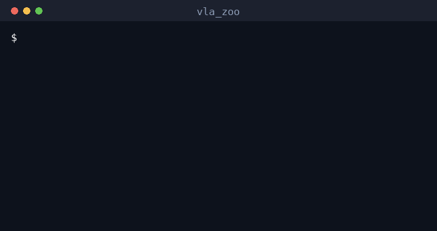
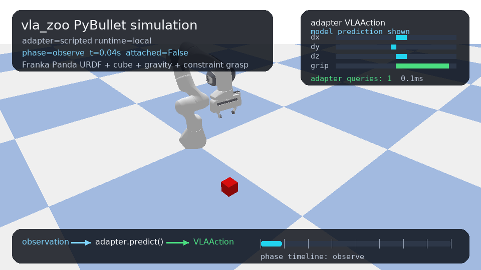
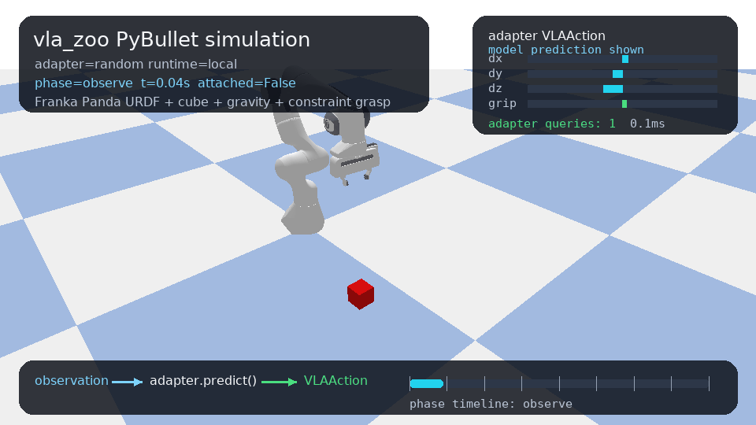
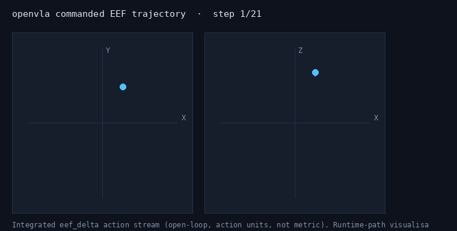
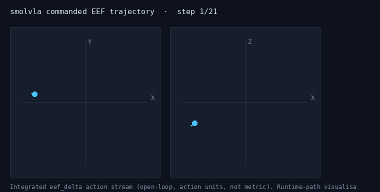
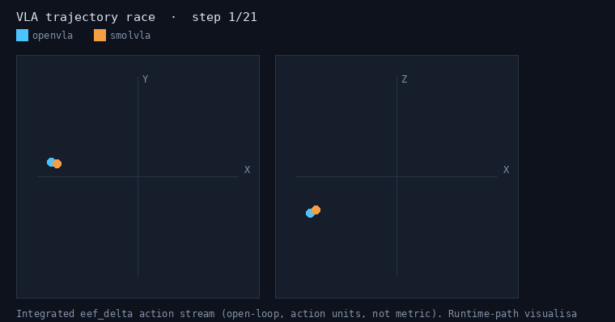
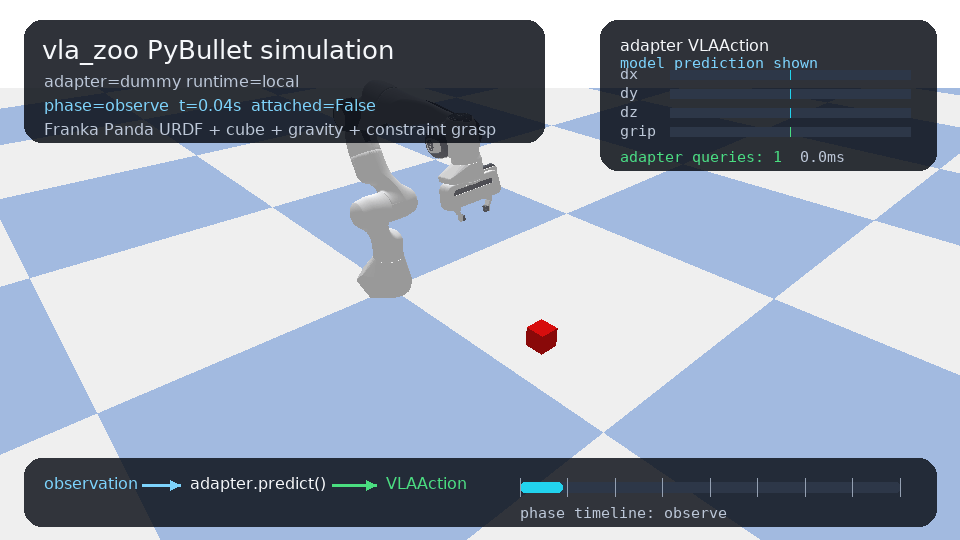
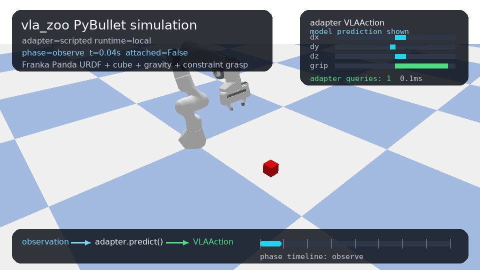
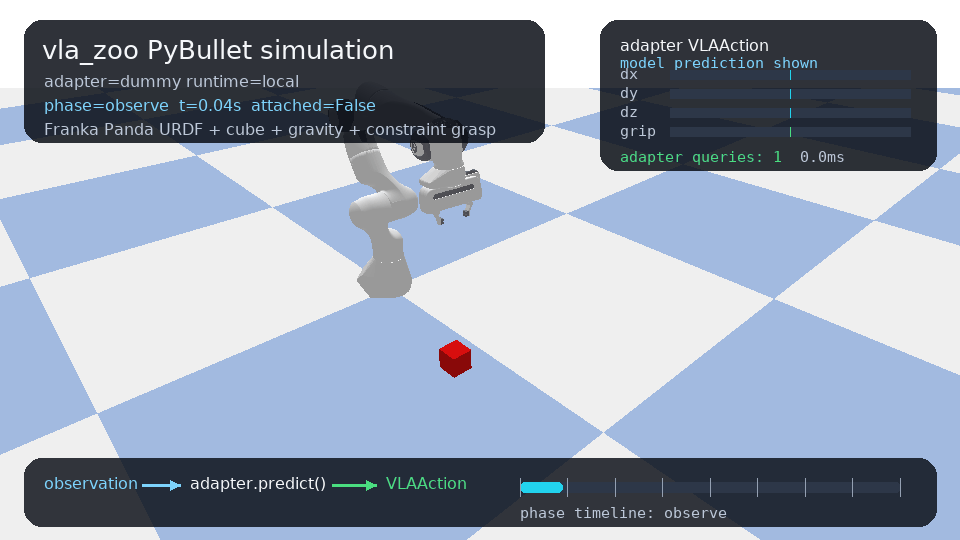
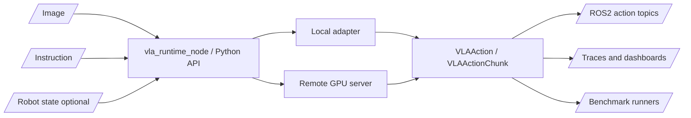

# vla_zoo

ROS2-native runtime, benchmark, and adapter hub for Vision-Language-Action models.

[](https://github.com/rsasaki0109/vla_zoo/actions/workflows/ci.yml)
[](pyproject.toml)
[](LICENSE)
[](docs/ros2_integration.md)
[](https://rsasaki0109.github.io/vla_zoo/)

> VLA models are moving fast. Robots still need stable runtime interfaces.
> `vla_zoo` connects camera + instruction + robot state to typed actions through
> Python, ROS2, local GPU inference, and remote GPU servers.

Live demo and reports: https://rsasaki0109.github.io/vla_zoo/



> `pip install -e . && vla-zoo quickstart` — runs the real runtime boundary on the
> pure-Python baselines (no GPU / weights / PyBullet) and writes a local report.


## Open First

| What to inspect | Link |
|---|---|
| VLA runtime leaderboard | [latency / throughput / memory, ranked](https://rsasaki0109.github.io/vla_zoo/assets/leaderboard/vla_runtime_leaderboard.html) |
| Runtime truth by model | [VLA evidence matrix](https://rsasaki0109.github.io/vla_zoo/assets/vla_model_evidence_matrix.html) |
| PyBullet simulation GIFs | [GIF gallery](https://rsasaki0109.github.io/vla_zoo/assets/gif_suite/) |
| Runtime comparison dashboard | [PyBullet report](https://rsasaki0109.github.io/vla_zoo/assets/sample_compare_suite/pybullet_report.html) |
| ROS2 remote path | [ROS2 remote dummy evidence](https://rsasaki0109.github.io/vla_zoo/assets/sample_ros2_remote_dummy/remote_smoke_check.md) |

The GIFs below are checked-in PyBullet runtime artifacts generated through
`vla_zoo` adapters. They demonstrate runtime plumbing and action visualization;
they are not real-robot skill claims.

| Scripted baseline | Dummy baseline | Random baseline |
|---|---|---|
|  |  |  |

These animate the **recorded action stream a real adapter produced** — the
end-effector path the policy's `eef_delta` commands trace out (integrated open-loop,
action units, not metric). It is a runtime-path visualization, not a real-EEF or
task-success claim.

| OpenVLA-7b commanded trajectory | SmolVLA commanded trajectory |
|---|---|
|  |  |

Overlaid on a shared scale, the two adapters race side by side — which makes it obvious
that SmolVLA commands much larger position deltas than OpenVLA-7b:



### Real-Time Chunking scheduler simulation

Action-chunking policies predict a horizon of future actions per inference. While the
controller executes them, the next chunk is computed in the background — and because that
inference takes time, naively swapping to the new chunk jumps between two independently
sampled plans at the boundary. [Real-Time Chunking](https://arxiv.org/abs/2506.07339)
(Black et al.) fixes this purely at inference time by *freezing* the actions guaranteed to
execute during inference and inpainting the rest.

`vla-zoo rtc-sim` is a pure CPU simulation of that scheduling layer. On a synthetic chunk
stream it cuts the mean chunk-boundary jump **~76%** vs naive async swapping
([recorded run](docs/assets/rtc_sim/rtc_scheduler_sim.md)). It models the freeze-prefix +
soft-mask blend, not the diffusion/flow gradient-guided sampler — a runtime scheduling
property, not a policy-quality or task-success claim.

```bash
vla-zoo rtc-sim --chunks 14 --horizon 16 --execute 8 --delay 4
```

## Why vla_zoo?

Most VLA repositories focus on model code, training, checkpoints, or task demos.
Real robot deployments need a different layer:

```text
camera + language + robot state + timestamp
  -> adapter/runtime boundary
  -> typed action or action chunk
  -> ROS2 topic, server response, benchmark step, or report artifact
```

`vla_zoo` is that boundary. It does not train models, redistribute weights, or
command hardware directly. It runs adapters behind a stable interface and makes
the resulting actions observable, replayable, and comparable.

## Current State

| Area | What is implemented |
|---|---|
| Python API | `load_model()`, typed `VLAObservation`, `VLAAction`, `VLAActionChunk` |
| Adapter registry | Built-ins plus Python entry point support for third-party adapters |
| OpenVLA | Lazy Hugging Face adapter path for `openvla/openvla-7b` on CUDA |
| ROS2 | Runtime node, typed messages, launch files, diagnostics, watchdogs |
| Remote inference | FastAPI server and remote client with the same `predict()` API |
| Reports | ROS2 smoke reports, action traces, action analysis, dashboard bundles |
| Simulation | PyBullet smoke scene and deterministic baseline comparison artifacts |
| Benchmarks | Smoke runner plus LIBERO, SimplerEnv, Genesis, and Isaac scaffolds |

The implemented CPU baselines are for infrastructure validation. Model quality
claims require real adapters, robot-specific calibration, and benchmark runs.

## Verification Status

Do not read this as "every VLA has been validated as a real robot policy." The
current verification is runtime-centric and intentionally explicit about what
did and did not run.

The most direct status page is the
[VLA model evidence matrix](https://rsasaki0109.github.io/vla_zoo/assets/vla_model_evidence_matrix.html):
it separates adapter contract, GPU inference, remote serving, ROS2 remote logs,
PyBullet traces, and policy-quality claims for each model family.

| Adapter group | Multi-task runtime status | Real model status |
|---|---|---|
| `dummy`, `scripted`, `random` | Verified on 3 PyBullet runtime tasks | Baselines only, not VLA model quality |
| `openvla` | Real-scene PyBullet action probe recorded (7-DoF on rendered frames) | Verified runtime path: local 4-bit (~4.6 GB), remote `/v1/predict`, and a ROS2 remote trace all recorded. Not a task-success claim |
| `smolvla` | Real-scene PyBullet action probe recorded (6-DoF on rendered frames) | Verified runtime path: local GPU (~0.97 GB), remote `/v1/predict` (incl. bf16 `--dtype` serve), and a ROS2 remote trace all recorded. Not a task-success claim |
| `pi0` / `openpi` | Remote-first adapter with opt-in LeRobot local loading | Version-matched checkpoint resolved (`lerobot/pi0_base`, bf16 fits 16 GB); local inference `blocked` on the gated `google/paligemma-3b-pt-224` tokenizer (reproducible probe). Use the remote runtime |
| `groot` / `gr00t` | Experimental and blocked until the NVIDIA Isaac GR00T stack is wired in | `blocked`, reproducibly probed: adapter raises rather than fabricating, and no GR00T package exists on PyPI (real runtime is the NVIDIA Isaac-GR00T GitHub stack) |

```bash
vla-zoo compare tasks \
  --models dummy,scripted,random \
  --tasks all \
  --out results/vla_task_verification/baseline_tasks.json \
  --markdown-out results/vla_task_verification/baseline_tasks.md \
  --html-out results/vla_task_verification/baseline_tasks.html
```

Sample artifacts:

| Pillar | Artifacts |
|---|---|
| Visual demos | [Action Playground](https://rsasaki0109.github.io/vla_zoo/assets/action_playground.html), [Local+remote playground](https://rsasaki0109.github.io/vla_zoo/assets/action_playground_with_remote.html), [Action Playground verification](docs/reports/model_comparison.md), [PyBullet GIF gallery](docs/assets/gif_suite/index.html), [GIF QA](docs/assets/gif_suite/gif_check.md), [PyBullet report](https://rsasaki0109.github.io/vla_zoo/assets/sample_compare_suite/pybullet_report.html) |
| Adapter/runtime truth | [VLA evidence matrix](https://rsasaki0109.github.io/vla_zoo/assets/vla_model_evidence_matrix.html), [Adapter cards](docs/adapters/README.md), [external adapter status](https://rsasaki0109.github.io/vla_zoo/assets/sample_task_verification/external_adapter_status.html), [robot compatibility](https://rsasaki0109.github.io/vla_zoo/assets/sample_compare_suite/robot_compatibility.md) |
| ROS2 / remote deployment | [Remote runtime smoke](docs/reports/remote_runtime_smoke.md), [ROS2 remote dummy evidence](https://rsasaki0109.github.io/vla_zoo/assets/sample_ros2_remote_dummy/remote_smoke_check.md), [ROS2 remote smoke plan](https://rsasaki0109.github.io/vla_zoo/assets/ros2_remote_smoke_plan.md), [ROS2 dashboard](https://rsasaki0109.github.io/vla_zoo/assets/sample_ros_runtime_dashboard.html) |
| Heavy VLA probes | [Real-scene probe comparison](https://rsasaki0109.github.io/vla_zoo/assets/sample_pybullet_compare/runtime_probe_comparison.html), [OpenVLA remote probe](https://rsasaki0109.github.io/vla_zoo/assets/sample_task_verification/openvla_remote_probe.md), [SmolVLA bf16 dtype-serve probe](https://rsasaki0109.github.io/vla_zoo/assets/sample_task_verification/smolvla_dtype_serve_probe.md), [pi0 compatibility](https://rsasaki0109.github.io/vla_zoo/assets/sample_task_verification/pi0_compatibility_probe.md), [GR00T block probe](https://rsasaki0109.github.io/vla_zoo/assets/sample_task_verification/groot_block_probe.md) |

## Quickstart

One command, no GPU / weights / PyBullet — it runs the real
`load_model() -> predict() -> typed action` boundary on the pure-Python baselines and
writes a local report that links on to the recorded real-adapter evidence:

```bash
pip install -e .          # or: pip install -e ".[cli,server,sim]" for the full stack
vla-zoo quickstart        # writes ./vla_zoo_quickstart/report.html and prints the path
```

Example output is published at
[assets/quickstart/report.html](https://rsasaki0109.github.io/vla_zoo/assets/quickstart/report.html).
This proves the plumbing works locally; it is not a model-quality claim.

```bash
git clone https://github.com/rsasaki0109/vla_zoo.git
cd vla_zoo
pip install -e ".[cli,server,sim]"
vla-zoo doctor --no-ros
vla-zoo predict --model dummy --instruction "pick up the red block"
```

```python
from vla_zoo import load_model

model = load_model("dummy")
action = model.predict(image=None, instruction="pick up the red block")

print(action.data)
print(action.spec.action_space)
```

The `dummy` adapter always works and returns a neutral 7-DoF `eef_delta` action.
It is the runtime smoke path for CI, docs, and ROS2 launch validation.

## SmolVLA On GPU

SmolVLA is a compact VLA from the LeRobot ecosystem. `vla_zoo` loads it lazily
through LeRobot and exposes the same `predict()` runtime boundary.

```bash
pip install -e ".[smolvla]"
python examples/python/load_smolvla.py --device cuda --local-files-only
```

The current local probe used `lerobot/smolvla_base` on an RTX 4070 Ti SUPER and
returned a 6D `custom` action through `load_model("smolvla")`. This proves the
adapter and GPU inference path, not robot task success. SmolVLA base still needs
robot/task-specific fine-tuning and calibrated camera/state/action interfaces.

A real-scene PyBullet action probe is also recorded: SmolVLA driven on genuinely
rendered frames (21 adapter queries, 6-DoF, latency p50 ~382 ms with a fresh
encode per query), exercising the real image-preprocessing path. It is compared
side by side with the OpenVLA-7b probe at the
[real-scene probe comparison](docs/assets/sample_pybullet_compare/runtime_probe_comparison.md)
and is a runtime-path record, not a task-success claim.

For the recommended deployment shape, run SmolVLA as a remote server in an
isolated environment (the `smolvla` extra pins `transformers`/`torch` versions
that clash with `openvla`). Generate a reproducible bring-up plan:

```bash
vla-zoo smolvla-remote-plan --public-host gpu-box --port 8000 --device cuda:0
```

See [SmolVLA remote serving](docs/smolvla_remote.md) and the generated
[remote serving plan](docs/assets/smolvla_remote_smoke_plan.md). This is a
command plan, not a recorded `/v1/predict` run, and makes no policy-quality claim.

## OpenVLA On GPU

OpenVLA is an external project. `vla_zoo` wraps it behind the runtime API and
does not redistribute OpenVLA code, checkpoints, or weights.

```bash
pip install -e ".[cli,server,sim,gpu,openvla]"
vla-zoo doctor --no-ros
vla-zoo gpu smoke --device cuda:0 --dtype float16
```

```bash
python examples/python/load_openvla.py \
  --pretrained openvla/openvla-7b \
  --device cuda:0 \
  --dtype bfloat16 \
  --unnorm-key bridge_orig
```

Expected adapter output shape when the OpenVLA model completes:

```text
VLAAction(data=[..., 0.99607843], spec=ActionSpec(action_space='eef_delta', shape=(7,)))
```

For robots that cannot host a large VLA locally, run the model on a GPU
workstation and keep the robot-side process light:

```bash
# GPU workstation
vla-zoo serve --model openvla \
  --host 0.0.0.0 \
  --port 8000 \
  --pretrained openvla/openvla-7b \
  --device cuda:0 \
  --dtype bfloat16 \
  --unnorm-key bridge_orig

# robot or ROS2 machine
ros2 launch vla_zoo remote.launch.py remote_url:=http://gpu-box:8000
```

Before driving the robot-side runtime, run a health-first probe that checks
`/health` and then records one `/v1/predict` response:

```bash
vla-zoo remote-probe --model openvla --remote-url http://gpu-box:8000 \
  --out results/openvla_remote_probe.json --strict
```

See [OpenVLA remote GPU path](docs/openvla_remote.md). The OpenVLA `remote_server`
evidence cell is now `verified`: a real 4-bit server passed a health-first probe
and returned a typed 7-DoF action over HTTP, recorded at
[`openvla_remote_probe.md`](docs/assets/sample_task_verification/openvla_remote_probe.md).
This is a runtime-path claim, not a task-success claim.

For multi-model comparisons, generate one GPU-server command per adapter:

```bash
vla-zoo serve-plan \
  --models openvla,pi0,smolvla,groot \
  --public-host gpu-box \
  --base-port 8001 \
  --markdown-out results/vla_gpu_servers.md
```

Sample server plan:
https://rsasaki0109.github.io/vla_zoo/assets/sample_compare_suite/gpu_server_plan.md

## pi0 / openpi Remote-First

pi0/openpi is remote-first: `load_model("pi0")` stays light and the
version-sensitive LeRobot/openpi stack lives in a dedicated serving environment.
Pin LeRobot/openpi to the version that matches your checkpoint.

```bash
# dedicated serving environment
vla-zoo serve --model pi0 --host 0.0.0.0 --port 8000 --device cuda:0 \
  --pretrained lerobot/pi0_base

# robot/client side
python examples/python/load_pi0_remote.py --remote-url http://gpu-box:8000
vla-zoo remote-probe --model pi0 --remote-url http://gpu-box:8000 --strict
```

See [pi0 / openpi remote-first path](docs/pi0_remote.md) and the generated
[pi0 server plan](docs/assets/pi0_server_plan.md). The pi0 `remote_server`
evidence cell stays `planned` until a real recorded pi0 response from a
version-matched server is checked in.

## GR00T (Blocked)

GR00T is experimental and **blocked until the NVIDIA Isaac GR00T stack is wired
in**. The adapter declares a runtime contract but ships no inference and makes no
task-success claim; `predict_observation` raises rather than fabricating actions.

```bash
vla-zoo info groot          # contract + blocked status
vla-zoo serve-plan --models groot
```

See the [GR00T blocked-status path](docs/groot_remote.md) for the expected
observation/action contract and what would unblock it. Every GR00T runtime cell in
the [evidence matrix](docs/assets/vla_model_evidence_matrix.html) stays `blocked`
or `partial` until a real serving adapter and a recorded action probe exist.

## ROS2 Runtime

```bash
pip install -e .
colcon build --base-paths ros2 --symlink-install
source install/setup.bash
ros2 launch vla_zoo dummy.launch.py
```

The ROS2 runtime subscribes to camera, instruction, and optional joint state
topics, then publishes typed actions, status, and diagnostics. Launch files
default to `dry_run:=true`.

```text
/camera/image_raw      sensor_msgs/msg/Image
/vla/instruction       std_msgs/msg/String or vla_zoo_msgs/msg/VLAInstruction
/joint_states          sensor_msgs/msg/JointState optional

/vla/action            vla_zoo_msgs/msg/VLAAction
/vla/action_chunk      vla_zoo_msgs/msg/VLAActionChunk
/vla/status            vla_zoo_msgs/msg/VLAStatus
/diagnostics           diagnostic_msgs/msg/DiagnosticArray
```

Self-contained ROS2 smoke run with synthetic camera input:

```bash
ros2 launch vla_zoo smoke.launch.py
```

Record status, diagnostics, and actions for reports:

```bash
vla-zoo ros smoke-report --output-dir results/ros2_smoke
```

Remote GPU smoke recording uses the same synthetic camera path but calls a GPU
server from the robot-side ROS2 node:

```bash
vla-zoo ros remote-smoke-report \
  --model openvla \
  --remote-url http://gpu-box:8001 \
  --output-dir results/ros2_remote_openvla \
  --duration-sec 30
vla-zoo ros remote-smoke-plan \
  --model openvla \
  --remote-url http://gpu-box:8001 \
  --markdown-out results/ros2_remote_smoke_plan.md
```

The checked sample uses a temporary local dummy HTTP server to prove the ROS2
remote runtime path without a GPU:

```bash
vla-zoo serve --model dummy --host 127.0.0.1 --port 8766
vla-zoo ros remote-smoke-report \
  --model dummy \
  --remote-url http://127.0.0.1:8766 \
  --output-dir docs/assets/sample_ros2_remote_dummy \
  --duration-sec 20
```

Sample ROS2 remote smoke plan:
https://rsasaki0109.github.io/vla_zoo/assets/ros2_remote_smoke_plan.md

Sample ROS2 remote dummy evidence:
https://rsasaki0109.github.io/vla_zoo/assets/sample_ros2_remote_dummy/remote_smoke_check.md

Replay recorded actions on a separate safe topic:

```bash
ros2 launch vla_zoo action_replay.launch.py \
  action_log_path:=results/ros2_smoke/vla_actions.jsonl
```

`action_replay.launch.py` publishes to `/vla/action_replay`, not `/vla/action`,
so it can be used for visualization, bridge dry-runs, and issue reproduction
without pretending to be the live controller path.

## PyBullet Smoke Comparisons

The bundled PyBullet scene validates runtime plumbing, reports, and action
shape handling. It is not a VLA skill benchmark.

Every adapter query receives a real rendered RGB observation. For VLA-shaped
probes, the PyBullet path now builds `primary` plus three LeRobot-style camera
keys and a fixed 6D simulation state vector:

```text
observation.images.camera1, camera2, camera3
[eef_target_x, eef_target_y, eef_target_z, cube_x, cube_y, gripper_open]
```

The README GIFs are generated from real PyBullet simulation runs. The current
gallery covers three tasks and three lightweight adapters: `dummy`, `scripted`,
and `random`.

| Task | Dummy | Scripted | Random |
|---|---|---|---|
| pick red block |  |  |  |
| move left |  |  |  |
| move right |  |  |  |

| What the GIFs prove | What they do not prove |
|---|---|
| PyBullet is actually simulated and rendered | Real robot task success |
| Adapters receive rendered RGB observations and simulation state | Zero-shot VLA policy quality |
| The runtime calls `adapter.predict()` and records `VLAAction` traces | OpenVLA/pi0/SmolVLA benchmark performance |
| GIFs, manifests, QA reports, and dashboards are reproducible | Hardware safety or calibrated robot deployment |

```bash
vla-zoo demo gif-suite \
  --models dummy,scripted,random \
  --tasks all \
  --out-dir docs/assets/gif_suite
vla-zoo demo gif-check docs/assets/gif_suite
vla-zoo demo gif-report --manifest docs/assets/gif_suite/gif_manifest.json
vla-zoo demo action-playground \
  --manifest docs/assets/gif_suite/gif_manifest.json \
  --out docs/assets/action_playground.html \
  --trace-out docs/assets/action_playground.json
vla-zoo demo action-playground-record \
  --model smolvla \
  --runtime remote \
  --remote-url http://gpu-box:8003 \
  --tasks all \
  --out results/smolvla/action_playground.json
vla-zoo demo action-playground-view \
  --trace docs/assets/action_playground.json,results/openvla/action_playground.json \
  --merged-out results/action_playground_merged.json \
  --out docs/assets/action_playground.html
vla-zoo demo action-playground-check \
  --trace docs/assets/action_playground.json \
  --out docs/assets/action_playground_check.json \
  --markdown-out docs/reports/model_comparison.md
vla-zoo demo action-playground-remote-smoke \
  --port 8765 \
  --out docs/assets/action_playground_remote_dummy.json \
  --merged-out docs/assets/action_playground_with_remote.json \
  --html-out docs/assets/action_playground_with_remote.html \
  --markdown-out docs/reports/remote_runtime_smoke.md
vla-zoo compare suite --out-dir results/vla_compare_suite
```

Live artifacts:

- Action Playground: https://rsasaki0109.github.io/vla_zoo/assets/action_playground.html
  task-level adapter cards, action magnitude comparison, and frame-by-frame traces
- Local+remote Action Playground: https://rsasaki0109.github.io/vla_zoo/assets/action_playground_with_remote.html
  local baseline traces plus a temporary HTTP dummy server smoke trace
- Action Playground verification: https://rsasaki0109.github.io/vla_zoo/reports/model_comparison.md
  9/9 recorded PyBullet runtime traces checked for frames, GIF links, and adapter errors
- VLA evidence matrix: https://rsasaki0109.github.io/vla_zoo/assets/vla_model_evidence_matrix.html
  contract, GPU, remote server, ROS2 remote, PyBullet, and policy-quality evidence by model
- Remote runtime smoke: https://rsasaki0109.github.io/vla_zoo/reports/remote_runtime_smoke.md
  3/3 remote dummy PyBullet traces over `/v1/predict` with 24 HTTP predictions
- PyBullet report: https://rsasaki0109.github.io/vla_zoo/assets/sample_compare_suite/pybullet_report.html
- Runtime dashboard: https://rsasaki0109.github.io/vla_zoo/assets/sample_compare_suite/runtime_dashboard.html
- ROS2 dashboard: https://rsasaki0109.github.io/vla_zoo/assets/sample_ros_runtime_dashboard.html
- ROS2 remote dummy evidence: https://rsasaki0109.github.io/vla_zoo/assets/sample_ros2_remote_dummy/remote_smoke_check.md
  ROS2 node to RemoteVLAClient to HTTP dummy server, with 69 typed actions recorded
- Action trace: https://rsasaki0109.github.io/vla_zoo/assets/sample_action_trace.html
- Action analysis: https://rsasaki0109.github.io/vla_zoo/assets/sample_action_analysis.md

## Benchmark Results (Schema + Replay)

Benchmarks emit a **versioned JSONL result schema** (`vla-zoo-benchmark/v1`) so
latency and action-rate summaries are reproducible. Results are runtime-centric:
`success` is `null` whenever no honest task-success claim can be made.

```bash
# smoke benchmark with schema output
vla-zoo bench --model dummy --episodes 5 \
  --jsonl-out out/smoke_results.jsonl --summary-md out/smoke_summary.md

# ROS bag replay stub: replays recorded JSONL action logs (native rosbag2 is future work)
vla-zoo bench-replay \
  --action-log docs/assets/sample_ros2_remote_dummy/vla_actions.jsonl \
  --summary-md docs/assets/sample_benchmark/ros2_replay_summary.md \
  --summary-out docs/assets/sample_benchmark/ros2_replay_summary.json

# render summaries into a comparison report (HTML + Markdown)
vla-zoo bench-report \
  --summaries docs/assets/sample_benchmark/ros2_replay_summary.json \
  --html-out docs/assets/sample_benchmark/benchmark_report.html
```

See the [benchmark result schema + ROS bag replay](docs/benchmark_results.md) doc, the
generated [ROS2 action replay summary](docs/assets/sample_benchmark/ros2_replay_summary.md)
(latency plus a ~2.5 Hz action rate from the recorded `dummy` stream), and the
[benchmark comparison report](docs/assets/sample_benchmark/benchmark_report.html).

## Comparing VLA Runtime Paths

Start by comparing adapter contracts without loading model weights:

```bash
vla-zoo compare adapters
vla-zoo compare methods --markdown-out results/vla_method_profiles.md
vla-zoo compare evidence \
  --models dummy,scripted,random,openvla,pi0,smolvla,groot \
  --markdown-out results/vla_model_evidence_matrix.md \
  --html-out results/vla_model_evidence_matrix.html
vla-zoo compare compatibility \
  --robot-profile single-camera-eef \
  --models openvla,pi0,smolvla,groot \
  --markdown-out results/vla_robot_compatibility.md
vla-zoo compare tasks --models dummy,scripted,random --tasks all
```

For real model-to-model checks, run heavyweight policies behind GPU servers and
compare them from the robot-side runtime:

```bash
vla-zoo compare pybullet \
  --models openvla,pi0,smolvla,groot \
  --runtime remote \
  --remote-map "openvla=http://gpu-box:8001,pi0=http://gpu-box:8002,smolvla=http://gpu-box:8003,groot=http://gpu-box:8004" \
  --markdown-out results/vla_runtime_comparison.md \
  --html-out results/vla_runtime_comparison.html
```

`vla-zoo serve-plan` emits the matching server commands and remote map for the
GPU side.

The output is runtime-centric: latency, action magnitude, action rate, adapter
errors, task telemetry, and self-contained HTML/JSON artifacts. Treat PyBullet
smoke numbers as deployment-path checks, not robot skill claims.

## Adapter Cards

Full adapter capability cards live in [docs/adapters/README.md](docs/adapters/README.md).
They record input requirements, action shape, chunking behavior, local/remote
runtime support, dependencies, license caveats, and verification status.

| Adapter | Runtime contract | Card |
|---|---|---|
| `dummy` | base install, neutral 7-DoF `eef_delta` | [card](docs/adapters/dummy.md) |
| `scripted` | base install, phase-aware PyBullet smoke baseline | [card](docs/adapters/scripted.md) |
| `random` | base install, seeded random baseline | [card](docs/adapters/random.md) |
| `openvla` | single-image OpenVLA-style 7-DoF `eef_delta` | [card](docs/adapters/openvla.md) |
| `pi0` / `openpi` | remote-first, checkpoint-specific action chunks | [card](docs/adapters/pi0.md) |
| `smolvla` | multi-camera/state LeRobot policy path | [card](docs/adapters/smolvla.md) |
| `groot` / `gr00t` | experimental humanoid/generalist placeholder | [card](docs/adapters/groot.md) |

External projects can register adapters through the `vla_zoo.adapters` entry point.
Every serious adapter should declare input requirements, action spec, control
rate, chunking behavior, dependency status, and license caveats.

## Architecture



Core contract:

```python
from vla_zoo import load_model

model = load_model("openvla", runtime="remote", remote_url="http://gpu-box:8000")
action = model.predict(image=image, instruction="pick up the red block")

assert action.spec.action_space in {"eef_delta", "eef_pose", "joint_position", "custom"}
```

## Safety Model

- The core package publishes typed actions; it does not directly actuate hardware.
- ROS2 launch files default to `dry_run:=true`.
- Runtime watchdogs track stale images and stale instructions.
- Actions are typed and can be clipped before publication.
- Real robots should use a low-rate VLA outer loop and deterministic high-rate controllers.
- Hardware bridges should live outside the core package and require explicit opt-in.

## Known Limitations

- `vla_zoo` does not train VLA models.
- `vla_zoo` does not guarantee zero-shot success on your robot.
- Real hardware deployment requires robot-specific action bridges and safety checks.
- Model adapters may require large GPU memory and external model licenses.
- Action representations differ across VLA families and must be normalized carefully.
- The base package intentionally avoids heavy ML dependencies.

## Docs

| Page | Link |
|---|---|
| Architecture | [docs/architecture.md](docs/architecture.md) |
| Adapter contract | [docs/adapter_contract.md](docs/adapter_contract.md) |
| ROS2 integration | [docs/ros2_integration.md](docs/ros2_integration.md) |
| Deployment (Jetson + remote GPU) | [docs/deployment.md](docs/deployment.md) |
| Benchmark design | [docs/benchmark_design.md](docs/benchmark_design.md) |
| Safety | [docs/safety.md](docs/safety.md) |
| Comparisons | [docs/comparisons.md](docs/comparisons.md) |

## Roadmap

- v0.1: Python API, dummy adapter, OpenVLA adapter, remote server/client, ROS2 node, action replay
- v0.2: pi0 remote-server examples, GR00T adapter implementation, richer SmolVLA task probes, ROS bag replay benchmark
- v0.3: LIBERO and SimplerEnv runners with reproducible result formats
- v0.4: lifecycle node, watchdogs, action bridges, real robot deployment guides
