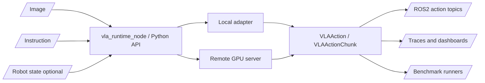

# vla_zoo

ROS2-native runtime, benchmark, and adapter hub for Vision-Language-Action models.

[](https://github.com/rsasaki0109/vla_zoo/actions/workflows/ci.yml)
[](pyproject.toml)
[](LICENSE)
[](docs/ros2_integration.md)
[](https://rsasaki0109.github.io/vla_zoo/)

> VLA models are moving fast. Robots still need stable runtime interfaces.
> `vla_zoo` connects camera + instruction + robot state to typed actions through
> Python, ROS2, local GPU inference, and remote GPU servers.

Live demo and reports: https://rsasaki0109.github.io/vla_zoo/


## Why vla_zoo?

Most VLA repositories focus on model code, training, checkpoints, or task demos.
Real robot deployments need a different layer:

```text
camera + language + robot state + timestamp
  -> adapter/runtime boundary
  -> typed action or action chunk
  -> ROS2 topic, server response, benchmark step, or report artifact
```

`vla_zoo` is that boundary. It does not train models, redistribute weights, or
command hardware directly. It runs adapters behind a stable interface and makes
the resulting actions observable, replayable, and comparable.

## Current State

| Area | What is implemented |
|---|---|
| Python API | `load_model()`, typed `VLAObservation`, `VLAAction`, `VLAActionChunk` |
| Adapter registry | Built-ins plus Python entry point support for third-party adapters |
| OpenVLA | Lazy Hugging Face adapter path for `openvla/openvla-7b` on CUDA |
| ROS2 | Runtime node, typed messages, launch files, diagnostics, watchdogs |
| Remote inference | FastAPI server and remote client with the same `predict()` API |
| Reports | ROS2 smoke reports, action traces, action analysis, dashboard bundles |
| Simulation | PyBullet smoke scene and deterministic baseline comparison artifacts |
| Benchmarks | Smoke runner plus LIBERO, SimplerEnv, Genesis, and Isaac scaffolds |

The implemented CPU baselines are for infrastructure validation. Model quality
claims require real adapters, robot-specific calibration, and benchmark runs.

## Verification Status

Do not read this as "every VLA has been validated as a real robot policy." The
current verification is runtime-centric and intentionally explicit about what
did and did not run.

| Adapter group | Multi-task runtime status | Real model status |
|---|---|---|
| `dummy`, `scripted`, `random` | Verified on 3 PyBullet runtime tasks | Baselines only, not VLA model quality |
| `openvla` | Adapter scaffold exercised; local heavy runs are skipped by default | Weights/deps were present locally, but the CUDA prompt probe did not complete due to insufficient free GPU memory in this run |
| `pi0` / `openpi` | Remote-first adapter with opt-in LeRobot local loading | Local real-model action probe not completed; use remote runtime for robot-side deployment |
| `smolvla` | Implemented local LeRobot adapter | GPU inference-path probe completed with `lerobot/smolvla_base`; this is not a task-success claim |
| `groot` / `gr00t` | Experimental placeholder status recorded | Not verified as a real model in this repo yet |

```bash
vla-zoo compare tasks \
  --models dummy,scripted,random \
  --tasks all \
  --out results/vla_task_verification/baseline_tasks.json \
  --markdown-out results/vla_task_verification/baseline_tasks.md \
  --html-out results/vla_task_verification/baseline_tasks.html
```

Sample artifacts:

- Multi-task baseline report: https://rsasaki0109.github.io/vla_zoo/assets/sample_task_verification/baseline_tasks.html
- External adapter status: https://rsasaki0109.github.io/vla_zoo/assets/sample_task_verification/external_adapter_status.html
- Adapter capability cards: [docs/adapters/README.md](docs/adapters/README.md)
- Robot compatibility report: https://rsasaki0109.github.io/vla_zoo/assets/sample_compare_suite/robot_compatibility.md
- GPU server plan: https://rsasaki0109.github.io/vla_zoo/assets/sample_compare_suite/gpu_server_plan.md
- ROS2 remote smoke plan: https://rsasaki0109.github.io/vla_zoo/assets/ros2_remote_smoke_plan.md
- OpenVLA prompt probe: https://rsasaki0109.github.io/vla_zoo/assets/sample_task_verification/openvla_prompt_probe.md
- pi0 compatibility probe: https://rsasaki0109.github.io/vla_zoo/assets/sample_task_verification/pi0_compatibility_probe.md
- SmolVLA GPU probe: https://rsasaki0109.github.io/vla_zoo/assets/sample_task_verification/smolvla_gpu_probe.md
- SmolVLA PyBullet probe: https://rsasaki0109.github.io/vla_zoo/assets/sample_task_verification/smolvla_pybullet_report.html

## Quickstart

```bash
git clone https://github.com/rsasaki0109/vla_zoo.git
cd vla_zoo
pip install -e ".[cli,server,sim]"
vla-zoo doctor --no-ros
vla-zoo predict --model dummy --instruction "pick up the red block"
```

```python
from vla_zoo import load_model

model = load_model("dummy")
action = model.predict(image=None, instruction="pick up the red block")

print(action.data)
print(action.spec.action_space)
```

The `dummy` adapter always works and returns a neutral 7-DoF `eef_delta` action.
It is the runtime smoke path for CI, docs, and ROS2 launch validation.

## SmolVLA On GPU

SmolVLA is a compact VLA from the LeRobot ecosystem. `vla_zoo` loads it lazily
through LeRobot and exposes the same `predict()` runtime boundary.

```bash
pip install -e ".[smolvla]"
python examples/python/load_smolvla.py --device cuda --local-files-only
```

The current local probe used `lerobot/smolvla_base` on an RTX 4070 Ti SUPER and
returned a 6D `custom` action through `load_model("smolvla")`. This proves the
adapter and GPU inference path, not robot task success. SmolVLA base still needs
robot/task-specific fine-tuning and calibrated camera/state/action interfaces.

The first PyBullet-rendered SmolVLA probe also runs locally: 3 adapter queries,
0 adapter errors, mean latency about 1.0 s, and a 6D action emitted from the
same 3-camera + state observation path used by the comparison runner.

## OpenVLA On GPU

OpenVLA is an external project. `vla_zoo` wraps it behind the runtime API and
does not redistribute OpenVLA code, checkpoints, or weights.

```bash
pip install -e ".[cli,server,sim,gpu,openvla]"
vla-zoo doctor --no-ros
vla-zoo gpu smoke --device cuda:0 --dtype float16
```

```bash
python examples/python/load_openvla.py \
  --pretrained openvla/openvla-7b \
  --device cuda:0 \
  --dtype bfloat16 \
  --unnorm-key bridge_orig
```

Expected adapter output shape when the OpenVLA model completes:

```text
VLAAction(data=[..., 0.99607843], spec=ActionSpec(action_space='eef_delta', shape=(7,)))
```

For robots that cannot host a large VLA locally, run the model on a GPU
workstation and keep the robot-side process light:

```bash
# GPU workstation
vla-zoo serve --model openvla \
  --host 0.0.0.0 \
  --port 8000 \
  --pretrained openvla/openvla-7b \
  --device cuda:0 \
  --dtype bfloat16 \
  --unnorm-key bridge_orig

# robot or ROS2 machine
ros2 launch vla_zoo remote.launch.py remote_url:=http://gpu-box:8000
```

For multi-model comparisons, generate one GPU-server command per adapter:

```bash
vla-zoo serve-plan \
  --models openvla,pi0,smolvla,groot \
  --public-host gpu-box \
  --base-port 8001 \
  --markdown-out results/vla_gpu_servers.md
```

Sample server plan:
https://rsasaki0109.github.io/vla_zoo/assets/sample_compare_suite/gpu_server_plan.md

## ROS2 Runtime

```bash
pip install -e .
colcon build --base-paths ros2 --symlink-install
source install/setup.bash
ros2 launch vla_zoo dummy.launch.py
```

The ROS2 runtime subscribes to camera, instruction, and optional joint state
topics, then publishes typed actions, status, and diagnostics. Launch files
default to `dry_run:=true`.

```text
/camera/image_raw      sensor_msgs/msg/Image
/vla/instruction       std_msgs/msg/String or vla_zoo_msgs/msg/VLAInstruction
/joint_states          sensor_msgs/msg/JointState optional

/vla/action            vla_zoo_msgs/msg/VLAAction
/vla/action_chunk      vla_zoo_msgs/msg/VLAActionChunk
/vla/status            vla_zoo_msgs/msg/VLAStatus
/diagnostics           diagnostic_msgs/msg/DiagnosticArray
```

Self-contained ROS2 smoke run with synthetic camera input:

```bash
ros2 launch vla_zoo smoke.launch.py
```

Record status, diagnostics, and actions for reports:

```bash
vla-zoo ros smoke-report --output-dir results/ros2_smoke
```

Remote GPU smoke recording uses the same synthetic camera path but calls a GPU
server from the robot-side ROS2 node:

```bash
vla-zoo ros remote-smoke-report \
  --model openvla \
  --remote-url http://gpu-box:8001 \
  --output-dir results/ros2_remote_openvla \
  --duration-sec 30
vla-zoo ros remote-smoke-plan \
  --model openvla \
  --remote-url http://gpu-box:8001 \
  --markdown-out results/ros2_remote_smoke_plan.md
```

Sample ROS2 remote smoke plan:
https://rsasaki0109.github.io/vla_zoo/assets/ros2_remote_smoke_plan.md

Replay recorded actions on a separate safe topic:

```bash
ros2 launch vla_zoo action_replay.launch.py \
  action_log_path:=results/ros2_smoke/vla_actions.jsonl
```

`action_replay.launch.py` publishes to `/vla/action_replay`, not `/vla/action`,
so it can be used for visualization, bridge dry-runs, and issue reproduction
without pretending to be the live controller path.

## PyBullet Smoke Comparisons

The bundled PyBullet scene validates runtime plumbing, reports, and action
shape handling. It is not a VLA skill benchmark.

Every adapter query receives a real rendered RGB observation. For VLA-shaped
probes, the PyBullet path now builds `primary` plus three LeRobot-style camera
keys and a fixed 6D simulation state vector:

```text
observation.images.camera1, camera2, camera3
[eef_target_x, eef_target_y, eef_target_z, cube_x, cube_y, gripper_open]
```

| Dummy | Scripted | Random |
|---|---|---|
|  |  |  |

```bash
vla-zoo demo pybullet --model dummy --out docs/assets/simulation_dummy.gif
vla-zoo compare suite --out-dir results/vla_compare_suite
```

Live artifacts:

- PyBullet report: https://rsasaki0109.github.io/vla_zoo/assets/sample_compare_suite/pybullet_report.html
- Runtime dashboard: https://rsasaki0109.github.io/vla_zoo/assets/sample_compare_suite/runtime_dashboard.html
- ROS2 dashboard: https://rsasaki0109.github.io/vla_zoo/assets/sample_ros_runtime_dashboard.html
- Action trace: https://rsasaki0109.github.io/vla_zoo/assets/sample_action_trace.html
- Action analysis: https://rsasaki0109.github.io/vla_zoo/assets/sample_action_analysis.md

## Comparing VLA Runtime Paths

Start by comparing adapter contracts without loading model weights:

```bash
vla-zoo compare adapters
vla-zoo compare methods --markdown-out results/vla_method_profiles.md
vla-zoo compare compatibility \
  --robot-profile single-camera-eef \
  --models openvla,pi0,smolvla,groot \
  --markdown-out results/vla_robot_compatibility.md
vla-zoo compare tasks --models dummy,scripted,random --tasks all
```

For real model-to-model checks, run heavyweight policies behind GPU servers and
compare them from the robot-side runtime:

```bash
vla-zoo compare pybullet \
  --models openvla,pi0,smolvla,groot \
  --runtime remote \
  --remote-map "openvla=http://gpu-box:8001,pi0=http://gpu-box:8002,smolvla=http://gpu-box:8003,groot=http://gpu-box:8004" \
  --markdown-out results/vla_runtime_comparison.md \
  --html-out results/vla_runtime_comparison.html
```

`vla-zoo serve-plan` emits the matching server commands and remote map for the
GPU side.

The output is runtime-centric: latency, action magnitude, action rate, adapter
errors, task telemetry, and self-contained HTML/JSON artifacts. Treat PyBullet
smoke numbers as deployment-path checks, not robot skill claims.

## Adapter Cards

Full adapter capability cards live in [docs/adapters/README.md](docs/adapters/README.md).
They record input requirements, action shape, chunking behavior, local/remote
runtime support, dependencies, license caveats, and verification status.

| Adapter | Runtime contract | Card |
|---|---|---|
| `dummy` | base install, neutral 7-DoF `eef_delta` | [card](docs/adapters/dummy.md) |
| `scripted` | base install, phase-aware PyBullet smoke baseline | [card](docs/adapters/scripted.md) |
| `random` | base install, seeded random baseline | [card](docs/adapters/random.md) |
| `openvla` | single-image OpenVLA-style 7-DoF `eef_delta` | [card](docs/adapters/openvla.md) |
| `pi0` / `openpi` | remote-first, checkpoint-specific action chunks | [card](docs/adapters/pi0.md) |
| `smolvla` | multi-camera/state LeRobot policy path | [card](docs/adapters/smolvla.md) |
| `groot` / `gr00t` | experimental humanoid/generalist placeholder | [card](docs/adapters/groot.md) |

External projects can register adapters through the `vla_zoo.adapters` entry point.
Every serious adapter should declare input requirements, action spec, control
rate, chunking behavior, dependency status, and license caveats.

## Architecture



Core contract:

```python
from vla_zoo import load_model

model = load_model("openvla", runtime="remote", remote_url="http://gpu-box:8000")
action = model.predict(image=image, instruction="pick up the red block")

assert action.spec.action_space in {"eef_delta", "eef_pose", "joint_position", "custom"}
```

## Safety Model

- The core package publishes typed actions; it does not directly actuate hardware.
- ROS2 launch files default to `dry_run:=true`.
- Runtime watchdogs track stale images and stale instructions.
- Actions are typed and can be clipped before publication.
- Real robots should use a low-rate VLA outer loop and deterministic high-rate controllers.
- Hardware bridges should live outside the core package and require explicit opt-in.

## Known Limitations

- `vla_zoo` does not train VLA models.
- `vla_zoo` does not guarantee zero-shot success on your robot.
- Real hardware deployment requires robot-specific action bridges and safety checks.
- Model adapters may require large GPU memory and external model licenses.
- Action representations differ across VLA families and must be normalized carefully.
- The base package intentionally avoids heavy ML dependencies.

## Docs

| Page | Link |
|---|---|
| Architecture | [docs/architecture.md](docs/architecture.md) |
| Adapter contract | [docs/adapter_contract.md](docs/adapter_contract.md) |
| ROS2 integration | [docs/ros2_integration.md](docs/ros2_integration.md) |
| Benchmark design | [docs/benchmark_design.md](docs/benchmark_design.md) |
| Safety | [docs/safety.md](docs/safety.md) |
| Comparisons | [docs/comparisons.md](docs/comparisons.md) |

## Roadmap

- v0.1: Python API, dummy adapter, OpenVLA adapter, remote server/client, ROS2 node, action replay
- v0.2: pi0 remote-server examples, GR00T adapter implementation, richer SmolVLA task probes, ROS bag replay benchmark
- v0.3: LIBERO and SimplerEnv runners with reproducible result formats
- v0.4: lifecycle node, watchdogs, action bridges, real robot deployment guides
