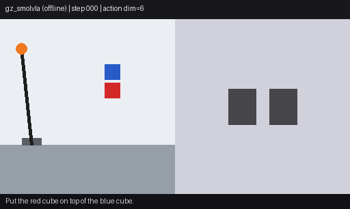
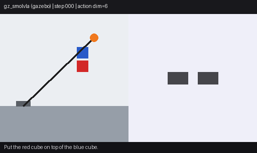

# vla_ros2

ROS2-native on-robot runtime for Vision-Language-Action (VLA) models.

[](https://github.com/rsasaki0109/vla_ros2/actions/workflows/ci.yml)
[](pyproject.toml)
[](LICENSE)
[](ros2)

> VLA models move fast; robots need a stable runtime interface.
> `vla_ros2` wires **camera + instruction + robot state** to **typed actions**
> and publishes them on ROS2 topics, running inference locally on the robot.

```text
camera + instruction + robot state + timestamp
  -> stable VLA adapter boundary (local inference)
  -> typed VLAAction / VLAActionChunk
  -> ROS2 topic (/vla/action, /vla/action_chunk) + /diagnostics
```

This project was previously `vla_zoo`, a broad runtime/benchmark/adapter hub.
It has been refocused into a single job: **run a VLA policy on a robot through
ROS2**. Benchmarking, comparison reports, PyBullet demos, and the remote-GPU
HTTP path have been removed.

## Demos

### Scripted PyBullet (baseline runtime loop)


A **Franka Panda in a PyBullet physics sim** performing pick-and-place, driven
through the real `vla_ros2` runtime: every control tick builds a
`VLAObservation`, calls `load_model("scripted")`, and the returned
`VLAAction` end-effector delta + gripper channel command the arm. It is the
`scripted` baseline adapter (not a learned VLA), but the loop, the physics, and
the action stream are real.

Reproduce: [`scripts/record_sim_demo.py`](scripts/record_sim_demo.py)

### SmolVLA closed-loop (learned policy)


**Real SmolVLA inference** (`lerobot/smolvla_base`) in a closed loop on a
LeRobot-aligned SO-100 kinematic stand-in initialized from
`lerobot/svla_so100_stacking`. When available, the demo uses a fine-tuned checkpoint
under `checkpoints/smolvla_so100_stacking_20k/` instead of the base model.

Reproduce: [`scripts/record_smolvla_so100_demo.py`](scripts/record_smolvla_so100_demo.py)

Fine-tune on the same dataset (optional; improves task fit vs `smolvla_base` alone):

```bash
STEPS=20000 BATCH_SIZE=16 OUTPUT_DIR=checkpoints/smolvla_so100_stacking_20k ./scripts/finetune_smolvla_so100.sh
./scripts/record_finetuned_gz_demo.sh   # after training; rewrites gz_smolvla_demo.gif
```

Quick wiring check: `./scripts/finetune_smolvla_so100.sh` (200 steps).

### SmolVLA × Gazebo actuation (ROS2 closed loop)


**Real SmolVLA inference** through the ROS2 runtime, SO-100-style camera rendered from
live `joint_states`, and 6D joint commands into `joint_trajectory_controller`.
Camera views are synthetic (not Gazebo RGB); joint motion is from the real sim graph.
Demo GIF uses a fine-tuned checkpoint (`checkpoints/smolvla_so100_stacking_20k/`).

Reproduce: [`scripts/record_gz_smolvla_demo.sh`](scripts/record_gz_smolvla_demo.sh)

#### base vs fine-tuned (same episode, 2026-06-09)

Instruction: *Put the red cube on top of the blue cube.* (`svla_so100_stacking`
episode 0). Metrics: [`docs/assets/gz_smolvla_compare_metrics.json`](docs/assets/gz_smolvla_compare_metrics.json).

**Offline kinematic loop** (60 steps, blend 0.35) — policy difference is visible:

| checkpoint | max joint Δ | GIF |
|---|---:|---|
| `lerobot/smolvla_base` | 175.5 |  |
| fine-tuned 20k | 7.6 |  |

**Gazebo closed loop** (60 s capture after runtime warmup, actuation on) —
inference publishes `/vla/action` (42–44 msgs/run). Joint displacement in sim
remains negligible (`max_joint_delta_rad` ≪ 1e-6); actuation scaling is still
under investigation:

| checkpoint | actions | max joint Δ (rad) | GIF |
|---|---:|---:|---|
| `lerobot/smolvla_base` | 42 | ~0 |  |
| fine-tuned 20k | 44 | ~0 |  |

Reproduce both: [`scripts/record_gz_smolvla_compare.sh`](scripts/record_gz_smolvla_compare.sh)

Launch manually: [ros2/SIM.md](ros2/SIM.md) (`gz_smolvla.launch.py`; GPU required).

### VLA Playground (browser)

Try adapters locally or drive a **Gazebo sim graph** (no real robot):

```bash
pip install -e ".[playground,smolvla]"

# Local inference or side-by-side adapter comparison (first tab)
python scripts/vla_playground.py

# Gazebo closed loop + browser (two terminals)
./scripts/launch_playground_gz.sh
python scripts/vla_playground.py --ros
# open http://127.0.0.1:7860 → "ROS2 live" tab → Send instruction
```

## Adapter comparison (measured locally)

Same synthetic input through each adapter: instruction
`stack the red block on the blue block`, state `[0, 45, 90, 0, 0, 0.5]`,
256×256 RGB frame (seed 0). Measured on **RTX 4070 Ti SUPER (16 GB)** with
`.venv-smolvla` on **2026-06-08**.

This compares **runtime wiring and latency**, not robot task success. Action
dimensions differ by adapter (7-DoF eef delta vs 6-DoF joint-style SmolVLA).

| model | checkpoint | ok | load | infer | shape | action (preview) |
|---|---|---:|---:|---:|---|---|
| `dummy` | — | yes | 0.6 ms | 0.0 ms | 7 | all zeros |
| `random` | — | yes | 0.5 ms | 0.1 ms | 7 | seeded random eef delta |
| `scripted` | — | yes | 0.0 ms | 0.1 ms | 7 | `[0.2, -0.1, 0.2, 0, 0, 0, 1]` |
| `smolvla` | `lerobot/smolvla_base` | yes | 40.6 s | 1014 ms | 6 | `[-0.29, 0.15, 0.22, 0.27, 1.67, -0.08]` |
| `smolvla` | fine-tuned 20k | yes | 33.1 s | 1224 ms | 6 | `[2.63, 95.39, 111.53, 43.74, 57.35, 5.95]` |
| `pi0` | `lerobot/pi0_base` | no | — | — | — | gated HF repo (token required) |
| `openvla` | `openvla/openvla-7b` | no | — | — | — | `[openvla]` extra not installed |

Fine-tuned SmolVLA outputs larger-magnitude 6D actions on this synthetic frame
than `smolvla_base`; that reflects checkpoint fit, not a sim/robot success rate.

Reproduce:

```bash
.venv-smolvla/bin/python scripts/compare_vla_models.py \
  --models dummy random scripted smolvla \
  --instruction "stack the red block on the blue block" \
  --state-json '{"state": [0, 45, 90, 0, 0, 0.5]}' \
  --device cuda \
  --out docs/assets/vla_compare_local.json

.venv-smolvla/bin/python scripts/compare_vla_models.py \
  --models smolvla \
  --pretrained smolvla=checkpoints/smolvla_so100_stacking_20k/checkpoints/020000/pretrained_model \
  --instruction "stack the red block on the blue block" \
  --state-json '{"state": [0, 45, 90, 0, 0, 0.5]}' \
  --device cuda \
  --out docs/assets/vla_compare_smolvla_finetuned.json
```

Full summary: [`docs/assets/vla_compare_summary.json`](docs/assets/vla_compare_summary.json)

## Layout

```text
src/vla_ros2/         Python package (adapter runtime)
  core/               typed contracts: VLAObservation/Action/ActionChunk, registry
  adapters/           dummy, random, scripted, openvla, smolvla, pi0, groot
  runtime/            local runtime, action-clip guard + watchdog, diagnostics
  cli/                minimal off-robot sanity CLI (vla-ros2 list / predict)
ros2/vla_ros2/        ROS2 ament_python package: runtime node, launch, config
ros2/vla_ros2_msgs/   ROS2 messages: VLAAction, VLAActionChunk, VLAStatus, VLAInstruction
```

## Install (Python package)

```bash
pip install -e .                 # core runtime + minimal CLI
pip install -e ".[openvla]"      # + OpenVLA dependencies
pip install -e ".[smolvla]"      # + SmolVLA (LeRobot) dependencies
pip install -e ".[playground]"   # + Gradio browser playground
pip install -e ".[dev]"          # + test/lint tooling
```

Sanity-check adapters off-robot, without ROS2:

```bash
vla-ros2 list                              # list registered adapters
vla-ros2 predict --model dummy             # run one local inference (wiring check)
vla-ros2 compare -m dummy -m random -m scripted   # same input, side-by-side actions
python scripts/compare_vla_models.py --models dummy smolvla --device cuda
```

## Run (ROS2 node)

Build the workspace first — see [ros2/WORKSPACE.md](ros2/WORKSPACE.md) or run
`./scripts/bootstrap_ros2_workspace.sh`.

The runtime node loads an adapter, subscribes to image/instruction/state, runs
local inference at `control_hz`, and publishes typed actions plus a diagnostics
record. It defaults to `dry_run: true` for safe bring-up.

```bash
source install/setup.bash
export PYTHONPATH="$PWD/src:$PYTHONPATH"

# dummy adapter, no GPU / weights required
ros2 launch vla_ros2 dummy.launch.py

# OpenVLA local inference (needs a GPU and openvla extras)
ros2 launch vla_ros2 openvla.launch.py dry_run:=false
```

`ros2 launch vla_ros2 smoke.launch.py` brings up the runtime node plus a
synthetic-input node, and a real typed `VLAAction` flows on `/vla/action`.

For real-robot wiring (topic remaps, clip calibration, phased `dry_run`
bring-up), see [ros2/BRINGUP.md](ros2/BRINGUP.md).

For Gazebo Sim (spawn arm, bridge `/vla/action` to `joint_trajectory_controller`),
see [ros2/SIM.md](ros2/SIM.md).

### Topics

| Direction | Topic (default) | Type |
|---|---|---|
| in  | `/camera/image_raw` | `sensor_msgs/Image` |
| in  | `/vla/instruction` | `std_msgs/String` or `vla_ros2_msgs/VLAInstruction` |
| in  | `/joint_states` | `sensor_msgs/JointState` |
| out | `/vla/action` | `vla_ros2_msgs/VLAAction` |
| out | `/vla/action_chunk` | `vla_ros2_msgs/VLAActionChunk` |
| out | `/vla/status` | `vla_ros2_msgs/VLAStatus` |
| out | `/diagnostics` | `diagnostic_msgs/DiagnosticArray` |

### Safety

- `dry_run` defaults to `true`; actions are not published until you opt in.
- An action-clip guard bounds every action to `[action_low, action_high]`.
- A watchdog flags stale/missing images and instructions and downgrades status.

## Adapters

`dummy`, `random`, `scripted` always load (no ML dependencies) and are used for
bring-up and tests. `openvla`, `smolvla`, `pi0`, `groot` require their optional
dependency extras and a suitable GPU. Inference runs **on the robot** (local
runtime); there is no remote-server path.

## Development

```bash
pip install -e ".[dev]"
ruff check src tests ros2
mypy src/vla_ros2
pytest
```

`tests/test_ros2_package_metadata.py` validates the `ros2/` package shape
(package.xml, setup.py entry points, messages, launch files) without requiring
a ROS2/colcon install, so CI guards the ROS2 integration on every push.

## License

Apache-2.0. See [LICENSE](LICENSE).
