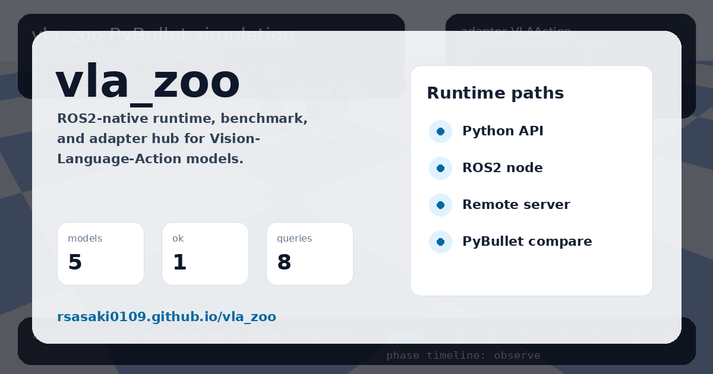
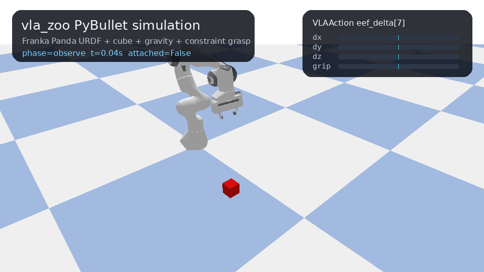
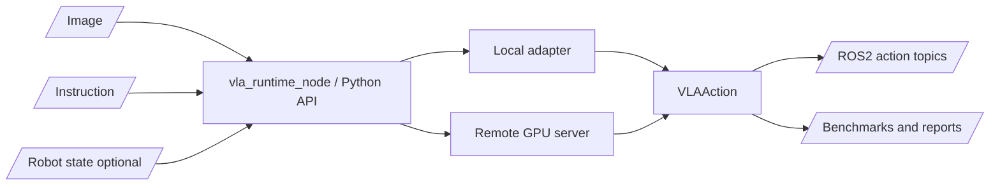

# vla_zoo

ROS2-native runtime, benchmark, and adapter hub for Vision-Language-Action models.

[](https://github.com/rsasaki0109/vla_zoo/actions/workflows/ci.yml)
[](pyproject.toml)
[](LICENSE)
[](docs/ros2_integration.md)
[](https://rsasaki0109.github.io/vla_zoo/)

> VLA models are moving fast. Robots still need stable runtime interfaces.
> `vla_zoo` connects camera + instruction + robot state to typed actions through
> Python, ROS2, local GPU inference, and remote GPU servers.

Live demo page: https://rsasaki0109.github.io/vla_zoo/



## What Works Now

| Area | Status |
|---|---|
| Python API | `load_model("dummy")`, typed `VLAAction`, adapter registry |
| OpenVLA | GPU inference path verified with `openvla/openvla-7b` |
| ROS2 | `vla_runtime_node`, launch files, typed action/status messages |
| Remote runtime | FastAPI server/client with the same `predict()` interface |
| Simulation | PyBullet smoke scene and generated GIF/report artifacts |
| Benchmarks | Smoke benchmark plus LIBERO/Simpler/Genesis/Isaac scaffolds |

`vla_zoo` does not train models, ship weights, or directly command robot hardware.
It publishes typed actions and leaves hardware execution to explicit downstream bridges.

## Quickstart

```bash
pip install -e ".[dev,cli,server,sim]"
vla-zoo doctor --no-ros
vla-zoo predict --model dummy --instruction "hello"
```

```python
from vla_zoo import load_model

model = load_model("dummy")
action = model.predict(image=None, instruction="pick up the red block")
print(action)
```

The dummy adapter is the lightweight CI/demo path. It validates the runtime without
downloading model weights.

## OpenVLA On GPU

OpenVLA is an external project. `vla_zoo` wraps it behind the stable runtime API;
it does not redistribute OpenVLA weights.

```bash
pip install -e ".[cli,server,sim,gpu,openvla]"
vla-zoo doctor --no-ros
vla-zoo gpu smoke --device cuda:0 --dtype float16
python examples/python/load_openvla.py \
  --pretrained openvla/openvla-7b \
  --device cuda:0 \
  --dtype bfloat16 \
  --unnorm-key bridge_orig
```

Example result from a real OpenVLA GPU run:

```text
VLAAction(data=[..., 0.99607843], spec=ActionSpec(action_space='eef_delta', shape=(7,)))
```

For robots that cannot host a large VLA locally, run inference on a GPU workstation:

```bash
# GPU workstation
vla-zoo serve --model openvla \
  --host 0.0.0.0 \
  --port 8000 \
  --pretrained openvla/openvla-7b \
  --device cuda:0 \
  --dtype bfloat16 \
  --unnorm-key bridge_orig

# robot / ROS2 machine
ros2 launch vla_zoo remote.launch.py remote_url:=http://gpu-box:8000
```

## ROS2

```bash
pip install -e .
colcon build --base-paths ros2 --symlink-install
source install/setup.bash
ros2 launch vla_zoo dummy.launch.py
```

The ROS2 runtime subscribes to camera, instruction, and optional joint state topics,
then publishes typed actions, status, and diagnostics.

| Topic | Type | Direction |
|---|---|---|
| `/camera/image_raw` | `sensor_msgs/msg/Image` | input |
| `/vla/instruction` | `std_msgs/msg/String` or `vla_zoo_msgs/msg/VLAInstruction` | input |
| `/joint_states` | `sensor_msgs/msg/JointState` | optional input |
| `/vla/action` | `vla_zoo_msgs/msg/VLAAction` | output |
| `/vla/action_chunk` | `vla_zoo_msgs/msg/VLAActionChunk` | output |
| `/vla/status` | `vla_zoo_msgs/msg/VLAStatus` | output |
| `/diagnostics` | `diagnostic_msgs/msg/DiagnosticArray` | output |

Dry-run is on by default. To publish dummy actions for demos/logging:

```bash
ros2 launch vla_zoo dummy.launch.py publish_actions_in_dry_run:=true
```

Typed instructions preserve `task_id` and metadata for ROS bag replay and benchmarks:

```bash
ros2 launch vla_zoo dummy.launch.py instruction_msg_type:=vla_instruction
python3 examples/ros2/publish_instruction.py --typed --task-id pick_red_block_001
```

## Demo And Reports

The bundled PyBullet demo is a deterministic runtime smoke scene, not a model
quality benchmark.



```bash
vla-zoo demo pybullet --model dummy --out docs/assets/simulation_pick_place.gif
vla-zoo compare suite --out-dir results/vla_compare_suite
```

Live samples:

- PyBullet report: https://rsasaki0109.github.io/vla_zoo/assets/sample_compare_suite/pybullet_report.html
- Runtime dashboard: https://rsasaki0109.github.io/vla_zoo/assets/sample_compare_suite/runtime_dashboard.html
- ROS2 dashboard: https://rsasaki0109.github.io/vla_zoo/assets/sample_ros_runtime_dashboard.html

## Adapters

| Adapter | Status | Notes |
|---|---|---|
| `dummy` | implemented | Neutral 7-DoF action for tests, docs, and ROS2 dry-runs |
| `scripted` | implemented | Rule-based baseline for the bundled smoke scene |
| `random` | implemented | Seeded random-action baseline |
| `openvla` | implemented scaffold | Local CUDA and remote runtime path; external weights required |
| `pi0` / `openpi` | placeholder | Remote-first adapter target |
| `smolvla` | placeholder | LeRobot/SmolVLA adapter target |
| `groot` / `gr00t` | experimental | Humanoid/generalist adapter target |

External projects can register adapters through the `vla_zoo.adapters` entry point.

## Architecture



## Safety

- No direct hardware actuation in the core package.
- ROS2 launch files default to `dry_run:=true`.
- Actions are typed and can be clipped before publication.
- Stale image/instruction watchdogs are part of the runtime node.
- Real robots should use a low-rate VLA outer loop plus deterministic high-rate controllers.

## Known Limitations

- `vla_zoo` does not train VLA models.
- `vla_zoo` does not guarantee zero-shot success on your robot.
- Real hardware deployment requires robot-specific action bridges and safety checks.
- Model adapters may require large GPU memory and external model licenses.
- The base package intentionally avoids heavy ML dependencies.

## Docs

| Page | Link |
|---|---|
| Architecture | [docs/architecture.md](docs/architecture.md) |
| Adapter contract | [docs/adapter_contract.md](docs/adapter_contract.md) |
| ROS2 integration | [docs/ros2_integration.md](docs/ros2_integration.md) |
| Benchmark design | [docs/benchmark_design.md](docs/benchmark_design.md) |
| Safety | [docs/safety.md](docs/safety.md) |
| Comparisons | [docs/comparisons.md](docs/comparisons.md) |

## Roadmap

- v0.1: Python API, dummy adapter, OpenVLA adapter, remote server/client, ROS2 node
- v0.2: SmolVLA/openpi/GR00T adapters, ROS bag replay benchmark
- v0.3: LIBERO and SimplerEnv runners with reproducible result formats
- v0.4: lifecycle node, watchdogs, action bridge examples, real robot deployment guides
