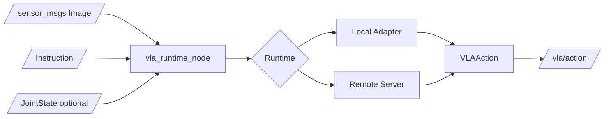

# Architecture

## Mission

`vla_zoo` is a ROS2-native runtime, benchmark, and adapter hub for Vision-Language-Action models. Its stable boundary is observation in, normalized action out.

## Non-goals

- No VLA training framework.
- No reinforcement learning framework.
- No direct hardware actuation by default.
- No vendored OpenVLA, openpi, LeRobot, or GR00T source trees.

## System Architecture



## Python API

```python
from vla_zoo import load_model

model = load_model("dummy")
action = model.predict(image=None, instruction="test")
```

The convenience API constructs a `VLAObservation`. Internal adapters implement `predict_observation()` and always return `VLAAction` or `VLAActionChunk`.

## Adapter Contract

Adapters declare:

- input requirements
- `ActionSpec`
- expected control rate
- action chunk behavior
- dependency status
- remote inference support
- license caveats

## ROS2 Topic Contract

Inputs:

- `/camera/image_raw`: `sensor_msgs/msg/Image`
- `/vla/instruction`: `std_msgs/msg/String` or future `vla_zoo_msgs/msg/VLAInstruction`
- `/joint_states`: optional `sensor_msgs/msg/JointState`

Outputs:

- `/vla/action`: `vla_zoo_msgs/msg/VLAAction`
- `/vla/action_chunk`: `vla_zoo_msgs/msg/VLAActionChunk`
- `/vla/status`: `vla_zoo_msgs/msg/VLAStatus`

## Runtime Modes

Local runtime keeps the adapter in the user or ROS2 process. Remote runtime calls an HTTP server so robot CPUs can delegate heavy inference to GPU workstations.

## Benchmark Architecture

Benchmarks use the same `BaseVLA.predict()` boundary as ROS2 and the server. The first implementation includes a smoke benchmark, while LIBERO, SimplerEnv, Genesis, Isaac, and ROS bag replay are reserved as backends.

## Safety Model

The core package only publishes action messages. Hardware-specific bridges must add clipping, stale-action timeouts, emergency stop handling, and controller-specific validation.

## Extension Roadmap

External packages can register adapters through the `vla_zoo.adapters` Python entry point group. Future ROS2 work should add lifecycle nodes, diagnostics, watchdog components, and bridge examples.
