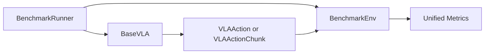

# Benchmark Design

Benchmarks consume the same `BaseVLA.predict()` interface as Python, ROS2, and HTTP serving.



## Metrics

- success_rate
- episode_return when available
- action_latency_ms_p50
- action_latency_ms_p95
- action_rate_hz
- sim_steps_per_sec
- real_time_factor
- action_smoothness
- action_clip_rate
- dropped_frame_count
- timeout_count
- exception_count

## Backends

LIBERO, SimplerEnv, Genesis, and Isaac are reserved as backend modules without hard dependencies in the base install.

## ROS Bag Replay

Future command:

```bash
vla-zoo bench rosbag \
  --bag ./bags/pick_red_block \
  --model openvla \
  --image-topic /camera/image_raw \
  --instruction-topic /vla/instruction \
  --output results.jsonl
```

Purpose:

- open-loop action regression
- latency profiling
- reproducibility for real robot data
- small issue reports from users
