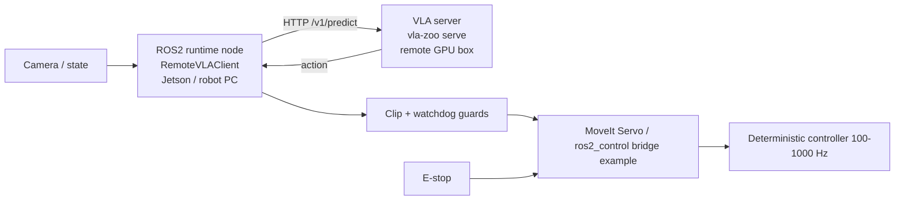

# Jetson + Remote GPU Deployment

The realistic deployment split for heavy VLA models is: a **lightweight robot-side
runtime** (e.g. on a Jetson or the robot computer) that talks ROS2 and runs the safety
guards, plus a **remote GPU box** that serves the heavyweight VLA model over HTTP. This
keeps heavy CUDA/transformer dependencies off the robot computer and out of the ROS2
environment.

This is an operations guide. It is runtime-centric and makes **no task-success claim**:
it wires up topology, serving, guards, and bridges; it does not assert robot-skill
quality.

## Topology



The robot side stays lightweight: it only needs ROS2, the `vla_zoo` core, and `httpx`.
The GPU box carries the model dependencies in an isolated environment.

## 1. Remote GPU box: serve the model

Install the model's heavy extra in a dedicated environment (kept off the robot) and serve:

```bash
# on the GPU box, in an isolated env (see the per-model remote docs)
vla-zoo serve --model openvla --host 0.0.0.0 --port 8000 --device cuda:0
```

Generate a reproducible server plan and verify health before wiring the robot:

```bash
vla-zoo serve-plan --models openvla --markdown-out server_plan.md
vla-zoo remote-probe --model openvla --remote-url http://gpu-box:8000 --strict
```

`remote-probe` checks `/health` before `/v1/predict`, so a down or mismatched server fails
fast. See the per-model remote paths: [OpenVLA](openvla_remote.md),
[SmolVLA](smolvla_remote.md), [pi0](pi0_remote.md). GR00T stays
[blocked](groot_remote.md) until its stack exists.

### Fitting heavy checkpoints on a 16 GB GPU

The full-precision weights of the larger adapters do not fit a 16 GB consumer card, so each
exposes a different memory-fit knob. The footprints below are **measured** on an GPU and are runtime-path numbers, not a task-success claim.

| Adapter | Knob | Measured footprint | How to pass it |
|---|---|---|---|
| OpenVLA-7b | 4-bit (bitsandbytes nf4) | ~4.6 GB peak (bf16 weights are ~15 GB and OOM) | `vla-zoo serve --model openvla --load-in-4bit` (server), or `load_model("openvla", load_in_4bit=True)` |
| SmolVLA / pi0 (LeRobot) | `dtype="bfloat16"` | pi0_base ~8.9 GB (its float32 config OOMs); SmolVLA already ~1 GB | `vla-zoo serve --model pi0 --pretrained lerobot/pi0_base --dtype bfloat16` (server), or `load_model("pi0", dtype="bfloat16")` |

Both knobs are exposed on `vla-zoo serve`: `--load-in-4bit` for OpenVLA, and `--dtype` for the
LeRobot adapters (it threads through to `load_model(..., dtype=...)` the same way). The LeRobot
`dtype` override builds the policy config with a pinned compute dtype before the weights load, so
the model never materializes in float32; the same value also works as a `load_model(...)` kwarg or
a `demo action-probe --adapter-kwarg dtype=bfloat16`. See the measured runs in
[OpenVLA local runtime](openvla_local_runtime.md) and
[SmolVLA local runtime](smolvla_local_runtime.md).

For pi0 specifically, local loading also runs a **preflight** that fails loudly rather than
silently serving a randomly-initialized model: LeRobot's `from_pretrained` returns an
un-weighted model when it cannot fetch `model.safetensors`, and the pi0 processor needs the
**gated** `google/paligemma-3b-pt-224` tokenizer. The preflight probes both (without
downloading the 14 GB weights) and raises an actionable `AdapterError` — download the
checkpoint, or accept the tokenizer license and supply an HF token. The full version matrix
is in the
[pi0 compatibility probe](assets/sample_task_verification/pi0_compatibility_probe.md).

## 2. Robot side (Jetson): ROS2 remote runtime

Run the runtime node in `remote` mode pointing at the GPU box. It defaults to dry-run safe
(no action publication unless explicitly enabled):

```bash
ros2 launch vla_zoo remote.launch.py \
  model_name:=openvla \
  remote_url:=http://gpu-box:8000 \
  dry_run:=true \
  require_image:=true \
  stale_image_timeout_sec:=1.0 \
  stale_instruction_timeout_sec:=5.0 \
  clip_actions:=true
```

See [ROS2 integration](ros2_integration.md) for topics, QoS, and parameters.

## 3. Safety guards (always on)

The node runs the pure, unit-tested guards from `vla_zoo.runtime.guard`:

- **Action clipping** clamps to the adapter's declared `low`/`high` (or configured
  `action_low`/`action_high`) and reports a clip rate.
- **Staleness watchdog** stops inference on stale image/instruction inputs and publishes a
  clear status (`waiting for image`, `stale image: <age>s`, `stale instruction: <age>s`).

See [Safety](safety.md). These shape and flag the action stream only; they never actuate.

## 4. Hardware bridge (example layer)

A bridge example consumes `/vla/action`, re-runs the guards, and forwards to the robot.
Both are **dry-run safe** (log-only without `--engage`):

```bash
# Cartesian / teleop path
python examples/ros2/moveit_servo_bridge.py            # dry-run
# controller-driven path
python examples/ros2/ros2_control_bridge.py            # dry-run
```

See the [MoveIt Servo](ros2_integration.md#moveit-servo-bridge-example-dry-run-safe) and
[ros2_control](ros2_integration.md#ros2_control-bridge-example-dry-run-safe) bridge
examples.

## What this guide does not provide

- Task-success or policy-quality numbers (out of scope; runtime-centric only).
- A turnkey hardware bridge — the bridges are examples; a real deployment must add an
  e-stop, workspace/joint-limit validation, and a high-rate deterministic controller.
- Jetson-specific CUDA/driver setup for local on-device inference; the recommended path
  keeps heavy inference on the remote GPU box.
