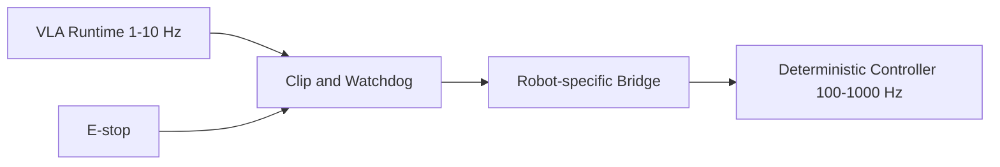

# Safety

`vla_zoo` publishes action messages. It does not directly actuate motors by default.

## Defaults

- `dry_run` defaults to true in ROS2 configs.
- ROS2 dry-run suppresses action publications unless `publish_actions_in_dry_run` is explicitly true.
- The dummy adapter returns neutral zero actions.
- The runtime publishes `/vla/status` and `/diagnostics` with latency, stale input, dropped frame, and clipping counters.
- Hardware bridges are outside the core package.

## Implemented ROS2 Guardrails

- `require_image` prevents image-based models from running before a camera frame is available.
- `stale_image_timeout_sec` and `stale_instruction_timeout_sec` stop inference on stale inputs.
- `clip_actions` clamps actions using adapter-declared bounds or configured `action_low` / `action_high`.
- `/diagnostics` exposes OK/WARN/ERROR status for orchestration and dashboards.

## Pure Runtime Guards (`vla_zoo.runtime.guard`)

The two safety-critical layers above are implemented as pure, framework-agnostic,
unit-tested functions so the ROS2 node and the core share one definition (the node
delegates to them):

- `clip_action_report(action, action_low=, action_high=)` clamps an action to its declared
  `low`/`high` (or a configured override) and reports how many elements were clamped.
- `ActionClipGuard` accumulates `action_clip_rate` and `element_clip_rate` across a stream
  for diagnostics/JSONL.
- `evaluate_watchdog(image_age_sec=, instruction_age_sec=, config=)` flags stale inputs and
  returns the same status text the runtime publishes (`waiting for image`,
  `stale image: <age>s`, `stale instruction: <age>s`).

These guards only shape and flag the action stream and report counters; they never actuate
motors. A real hardware bridge must still add an e-stop, workspace/joint limits, and a
high-rate deterministic controller.

## Required Real Robot Layers

- stale action timeout
- action clipping
- emergency stop integration
- workspace and joint limit validation
- low-rate VLA outer loop
- high-rate deterministic controller
- health checks and diagnostics

## Deployment Pattern

Adapters may produce actions in different representations. Bridge packages must verify action space, frame, bounds, and timing before forwarding commands.

`vla_zoo` should be treated as a low-rate outer-loop policy source. A real robot deployment still needs a hardware-specific bridge, deterministic high-rate controller, physical limit checks, and an emergency stop path outside the core package.
