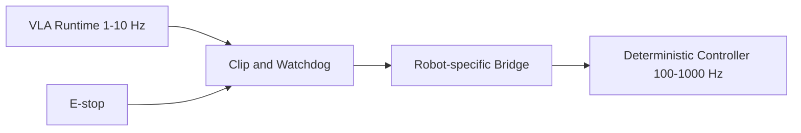

# Safety

`vla_zoo` publishes action messages. It does not directly actuate motors by default.

## Defaults

- `dry_run` defaults to true in ROS2 configs.
- The dummy adapter returns neutral zero actions.
- Hardware bridges are outside the core package.

## Required Real Robot Layers

- stale action timeout
- action clipping
- emergency stop integration
- workspace and joint limit validation
- low-rate VLA outer loop
- high-rate deterministic controller
- health checks and diagnostics

## Deployment Pattern

Adapters may produce actions in different representations. Bridge packages must verify action space, frame, bounds, and timing before forwarding commands.
